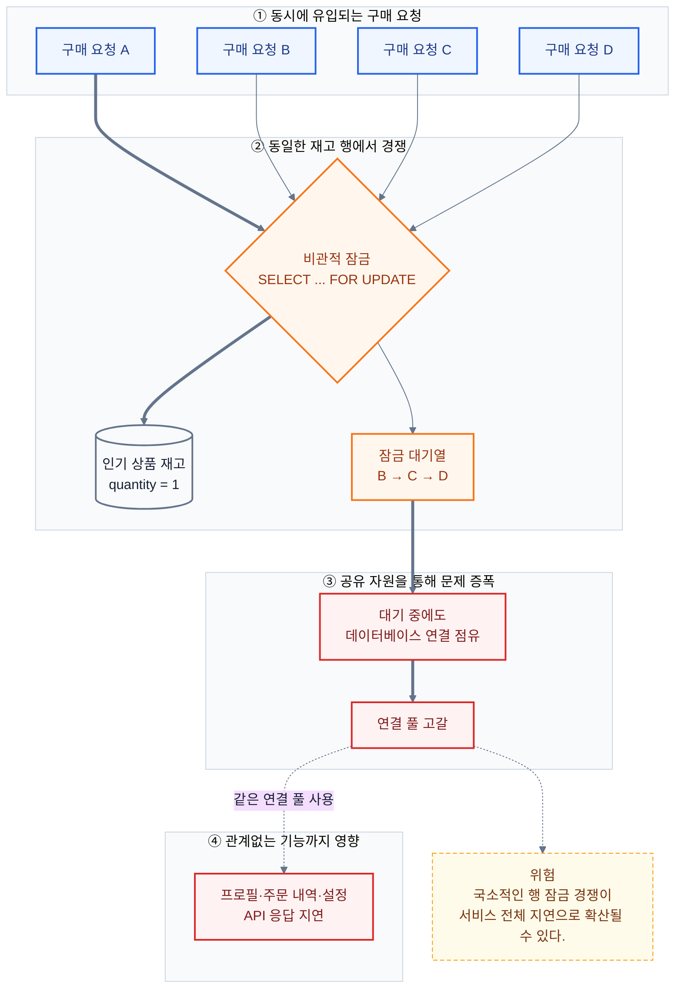
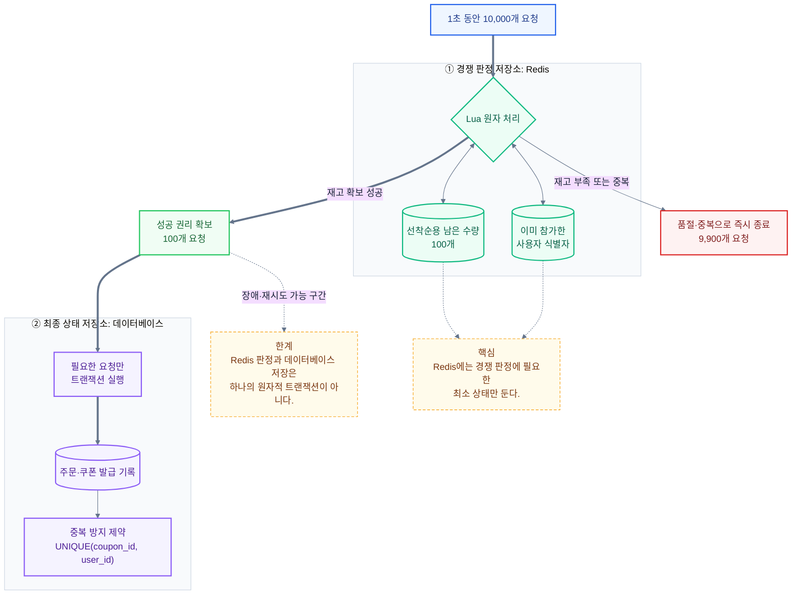
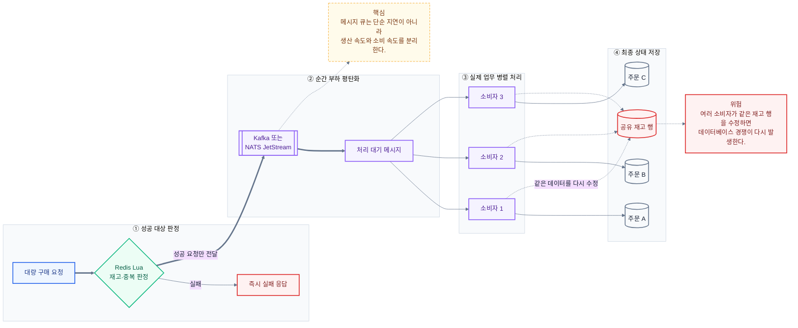
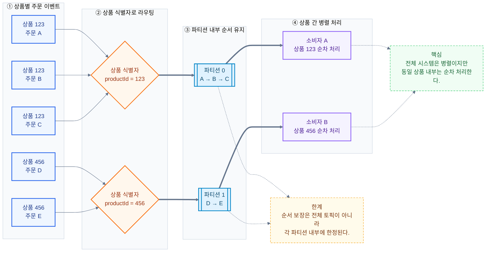

# AI가 만든 비관적 잠금이 불안했다: GPT-5.6 Sol과 Redis·Kafka까지 파고든 대화

GPT-5.6 Sol이 공개된 뒤 처음으로 제법 깊은 기술 대화를 나눠봤다.

주제는 데이터베이스 동시성 제어였다. 시작은 거창한 아키텍처 설계가 아니었다. Sol과 코드를 작성하면서 한 가지 패턴이 반복해서 눈에 들어왔다.

동시성 문제가 등장할 때마다 비관적 잠금이 우선 선택되는 경우가 많았다는 점이다.

비관적 잠금 자체는 검증된 해결책이다. 하지만 트래픽 규모와 충돌 범위를 충분히 따지지 않은 채 기본 선택지처럼 사용하면, 특정 기능에서 발생한 잠금 대기가 데이터베이스 연결 풀 전체에 영향을 줄 수 있다.

나는 이 부분이 우려됐다.

> 동시성 문제가 있다고 매번 비관적 잠금을 사용하는 것이 안전한 설계일까? 요청이 몰리면 데이터베이스에 부담을 주지 않을까?

이 질문에서 시작한 대화는 데이터베이스 잠금, 인메모리 저장소 Redis의 원자 처리, 메시지 브로커 Kafka와 NATS JetStream, 메시지 소비자 병렬 처리와 파티션 설계까지 이어졌다.

이번 글은 [실제 질의응답](https://chatgpt.com/share/6a7a732c-b8f0-83ee-bbb2-e1d427d6c5cb)을 바탕으로 그 과정에서 이해한 내용을 다시 정리한 기록이다.

## 비관적 잠금은 정말 위험한가?

비관적 잠금(pessimistic lock)은 다른 요청이 동일한 데이터를 변경하지 못하도록 먼저 잠근 뒤 작업을 진행하는 방식이다.

재고 차감처럼 반드시 일관성을 지켜야 하는 상황에서는 이해하기 쉽고 안전한 선택이 될 수 있다. 문제는 동일한 데이터 행에 요청이 집중되는 경우다.

PostgreSQL의 행 잠금은 일반적인 데이터 조회를 막지는 않는다. 하지만 같은 행을 수정하거나 다시 잠그려는 트랜잭션은 기존 트랜잭션이 종료될 때까지 대기한다. [PostgreSQL 행 잠금 공식 문서](https://www.postgresql.org/docs/current/explicit-locking.html#LOCKING-ROWS)

인기 상품의 재고 행 하나에 수백 개의 요청이 몰리면 실제로 재고를 처리하는 트랜잭션은 하나지만, 나머지 요청은 잠금이 해제되기를 기다리게 된다.



위험은 잠금 하나에서 끝나지 않는다.

대기 중인 요청들이 데이터베이스 연결을 점유하면 연결 풀(connection pool)이 고갈될 수 있다. 선착순 구매 기능에서 시작한 문제가 프로필 조회나 주문 내역처럼 아무 관련이 없는 응용 프로그래밍 인터페이스(API)까지 지연시킬 수 있다는 뜻이다.

그렇다고 비관적 잠금을 사용하면 안 된다는 결론은 아니다.

중요한 것은 잠금을 적용하기 전에 다음 조건을 확인하는 것이다.

- 실제로 여러 단계의 조회와 판단을 하나의 트랜잭션으로 보호해야 하는가?
- 조건부 갱신 쿼리 한 번으로 처리할 수는 없는가?
- 경쟁하는 모든 요청이 데이터베이스까지 들어와야 하는가?
- 잠금 대기가 다른 API로 전파될 가능성은 없는가?
- 트래픽 규모에 비해 지나치게 무거운 해결책은 아닌가?

예를 들어 단순 재고 감소라면 PostgreSQL에서는 다음과 같은 조건부 갱신도 검토할 수 있다.

```sql
UPDATE stock
SET quantity = quantity - 1
WHERE product_id = $1
  AND quantity > 0
RETURNING quantity;
```

별도의 조회와 명시적 `SELECT ... FOR UPDATE` 단계를 줄이고, 갱신된 행의 존재 여부로 성공과 실패를 판단하는 방식이다. `UPDATE` 자체도 행 잠금을 획득하므로 충돌한 갱신은 대기할 수 있다.

물론 실제 주문 생성이나 결제 상태 변경처럼 여러 작업을 함께 보장해야 한다면 트랜잭션과 잠금이 다시 필요할 수 있다.

핵심은 잠금을 피하는 것이 아니라 필요한 범위만 잠그는 것이다.

## 두 세션으로 확인한 잠금 대기

이번 수정에서는 로컬 PostgreSQL 18.4의 별도 데이터베이스에서 두 세션을 열어 행 하나에 대한 대기를 확인했다. 아래 수량과 테이블은 재현용 입력이며 실제 상품 데이터가 아니다. 기본 격리 수준인 `READ COMMITTED`에서 실행했다.

먼저 준비한다.

```sql
CREATE TABLE lock_example (
  id bigint PRIMARY KEY,
  remaining integer NOT NULL CHECK (remaining >= 0)
);
INSERT INTO lock_example VALUES (1, 1);
```

세션 A에서 다음을 실행하고 커밋하지 않는다.

```sql
BEGIN;
SELECT remaining FROM lock_example WHERE id = 1 FOR UPDATE;
-- 1
```

이 상태에서 세션 B의 자동 커밋 모드로 실행했다.

```sql
SET lock_timeout = '500ms';
SELECT remaining FROM lock_example WHERE id = 1 FOR UPDATE;
-- ERROR: canceling statement due to lock timeout
```

세션 A가 다음 변경을 커밋한 뒤, 세션 B에서 새 트랜잭션을 시작했다.

```sql
-- 세션 A
UPDATE lock_example
SET remaining = remaining - 1
WHERE id = 1 AND remaining > 0;
COMMIT;

-- 세션 B
BEGIN;
SELECT remaining FROM lock_example WHERE id = 1 FOR UPDATE;
-- 0
UPDATE lock_example
SET remaining = remaining - 1
WHERE id = 1 AND remaining > 0
RETURNING remaining;
-- 반환 행 없음, UPDATE 0
COMMIT;
```

최종 수량은 0이었다. 잠금 획득 뒤 확인한 수량과 갱신 결과를 기준으로 다음 요청을 거절할 수 있음을 확인했다. 명시적 트랜잭션 안에서 시간 초과가 발생했다면 실패한 트랜잭션을 `ROLLBACK`한 뒤 재시도해야 한다.

이 실험은 연결 풀 고갈이나 처리량을 측정하지 않는다. 500ms도 권장 설정이 아니라 대기를 짧게 관찰하려고 정한 실험값이다. 운영 판단에는 잠금 대기 시간, 연결 풀 대기, 요청 마감 시간과 재시도 횟수를 함께 봐야 한다.

또한 앞서 제시한 조건부 `UPDATE`도 행 잠금을 획득하므로 충돌한 갱신은 기다릴 수 있다. 별도 조회와 `FOR UPDATE` 단계를 줄인 것이지 잠금 없는 연산이 된 것은 아니다. 이 구분은 [PostgreSQL 행 잠금 설명](https://www.postgresql.org/docs/current/explicit-locking.html#LOCKING-ROWS)과 함께 확인할 수 있다.

## 경쟁이 심해지면 데이터베이스를 키우면 될까?

비관적 잠금의 위험을 이야기하다 보니 다음 질문으로 이어졌다.

> 동일한 데이터에 대한 경쟁이 심해졌을 때 데이터베이스를 스케일업하면 문제가 완화될까?

서로 다른 데이터 행을 수정하면서 중앙처리장치(CPU)나 입출력 자원이 부족한 상황이라면 데이터베이스 스케일업이 처리량을 높일 수 있다.

하지만 모든 요청이 동일한 재고 행 하나를 기다리는 상황은 다르다.

CPU를 4개에서 32개로 늘리고 메모리를 확장해도 동일한 행을 한 번에 하나의 트랜잭션만 변경할 수 있다는 직렬화 구조는 사라지지 않는다.

오히려 더 많은 요청과 연결을 받아들이면서 대기 중인 트랜잭션만 증가할 수도 있다.

따라서 장애를 분석할 때는 자원 부족과 잠금 경쟁을 구분해야 한다.

- CPU와 입출력 사용률이 포화됐다면 스케일업을 검토한다.
- 특정 데이터 행의 잠금 대기가 증가했다면 동시성 설계를 검토한다.

그리고 나는 한 가지 전제를 추가했다.

> 트랜잭션은 이미 충분히 짧게 유지한다고 가정하면, 그다음에는 Redis 같은 저장소로 데이터베이스까지 들어오는 요청 자체를 줄여야 하는 걸까?

이 질문부터 대화의 범위가 데이터베이스 내부에서 시스템 전체로 확장됐다.

## Redis를 데이터베이스 앞의 경쟁 판정 계층으로 사용하기

재고가 100개인데 10,000개의 구매 요청이 동시에 들어왔다고 생각해 보자.

모든 요청을 데이터베이스까지 전달하면 데이터베이스 연결 풀과 동일 재고 행에 그대로 경쟁이 발생한다.

인메모리 저장소 Redis를 앞에 두면 재고를 받을 수 있는 요청만 먼저 판정하고, 성공한 요청만 데이터베이스로 전달할 수 있다.



이 구조에서 Redis를 사용하는 이유는 단순히 데이터베이스보다 빠르기 때문이 아니다.

데이터베이스가 경쟁 판정과 대기열 역할까지 맡지 않도록 보호하는 것이 핵심이다.

## Redis 원자 처리는 무엇을 보장할까?

애플리케이션에서 재고 조회와 변경을 분리하면 경쟁 상태가 발생할 수 있다.

```typescript
const stock = await redis.get("stock");

if (Number(stock) > 0) {
  await redis.set("stock", Number(stock) - 1);
}
```

두 요청이 동시에 재고 1을 읽으면 두 요청 모두 구매에 성공했다고 판단할 수 있다.

Redis의 개별 감소 명령은 원자적으로 실행되지만, 여러 조건을 한 번에 판정해야 한다면 Lua 스크립트를 사용할 수 있다.

```lua
local stock = tonumber(redis.call("GET", KEYS[1]) or "0")

if stock <= 0 then
    return 0
end

if redis.call("SISMEMBER", KEYS[2], ARGV[1]) == 1 then
    return -1
end

redis.call("DECR", KEYS[1])
redis.call("SADD", KEYS[2], ARGV[1])

return 1
```

이 스크립트는 다음 작업을 하나의 원자 처리 범위에서 수행한다.

1. 남은 재고를 확인한다.
2. 사용자가 이미 참여했는지 확인한다.
3. 재고를 감소시킨다.
4. 참가한 사용자 식별자를 기록한다.

Redis는 Lua 스크립트가 실행되는 동안 다른 명령이 중간에 끼어들지 못하도록 보장한다. 대신 실행 중에는 다른 Redis 작업도 대기하므로 스크립트를 짧게 유지해야 한다. [Redis Lua 스크립트 공식 문서](https://redis.io/docs/latest/develop/programmability/eval-intro/)

여기서 다시 궁금해졌다.

> Lua에서 재고와 사용자 중복 여부를 판단하려면 그 정보가 Redis에 미리 있어야 하지 않을까?

맞다.

하지만 사용자 이름, 이메일, 주소 같은 전체 도메인 정보를 Redis에 복제할 필요는 없다. 경쟁 판정에 필요한 최소 상태만 두면 된다.

Redis에는 다음과 같은 상태가 필요하다.

- 선착순용 남은 수량
- 이미 참가한 사용자 식별자

반면 사용자 전체 정보, 상품 정보, 실제 주문과 최종 발급 기록은 데이터베이스가 관리한다.

판정 조건이 복잡하다는 이유로 사용자 등급, 최근 구매 금액, 계정 상태까지 Redis에 복제하기 시작하면 데이터베이스와 Redis 사이의 동기화 문제가 급격히 커진다.

Redis를 단순 캐시가 아니라 동시성 제어용 상태 저장소로 사용한다면 장애 복구 전략도 필요하다. Redis의 데이터가 사라졌을 때 선착순 결과를 어떻게 복원할지, 데이터베이스의 최종 기록과 차이가 발생하면 무엇을 기준으로 보정할지 결정해야 한다.

## 메시지 큐를 넣으면 경쟁은 사라질까?

Redis에서 성공 요청을 판정한 다음에는 실제 주문을 데이터베이스에 저장해야 한다.

이 지점에서 메시지 브로커 Kafka나 NATS JetStream 같은 메시지 큐를 사용할 수 있다.

그러자 다음 의문이 생겼다.

> Redis로 선착순을 판정하고 Kafka나 NATS JetStream으로 전달하면 되는 걸까? 메시지 소비자가 여러 개라면 결국 다시 병렬 처리되는 것 아닌가? 메시지 큐가 한 번 지연시켜 주니까 괜찮은 걸까?

메시지 소비자(consumer)가 여러 개면 실제 업무는 병렬로 처리된다.

메시지 큐가 있다고 경쟁 상태가 자동으로 사라지는 것은 아니다.



메시지 큐의 핵심은 단순히 작업을 지연시키는 것이 아니다.

생산 속도와 소비 속도를 분리해 순간 부하를 평탄화하는 것이 중요하다.

1초 동안 성공 요청 1,000개가 만들어졌더라도 데이터베이스가 초당 100개만 안정적으로 처리할 수 있다면, 메시지를 큐에 쌓고 소비자 수와 처리량을 조절할 수 있다.

다만 큐를 추가했다고 처리량이 저절로 제한되는 것은 아니다. 소비자 동시 실행 수, 한 번에 가져오는 메시지 수, 재시도 정책 등을 데이터베이스가 감당할 수 있는 범위로 설정해야 한다.

NATS JetStream의 공유 소비자는 여러 작업자에 메시지를 분배해 수평 확장할 수 있다. 또한 확인 응답이 정상적으로 처리되지 않으면 메시지가 재전달될 수 있다. [NATS JetStream 소비자 공식 문서](https://docs.nats.io/nats-concepts/jetstream/consumers)

따라서 주문 처리 소비자는 같은 메시지를 다시 받아도 결과가 중복되지 않는 중복 실행 안전성(idempotency)을 갖춰야 한다.

## 여러 소비자가 같은 데이터를 수정하면 경쟁은 돌아온다

Redis에서 재고를 확보한 뒤 소비자들이 서로 다른 주문 행만 생성한다면 병렬 처리가 비교적 쉽다.

하지만 모든 소비자가 데이터베이스의 동일한 재고 행을 다시 감소시키면 경쟁은 재발한다.

```sql
UPDATE product
SET stock = stock - 1
WHERE product_id = 123;
```

Redis에서 한 번 경쟁을 정리했는데 데이터베이스에서 다시 동일한 공유 자원을 경쟁적으로 수정하는 구조가 되는 것이다.

이 문제는 메시지를 공유 자원 단위로 라우팅해 완화할 수 있다.

Kafka에서는 동일한 상품 식별자를 같은 파티션으로 보내도록 설계할 수 있다. 하나의 소비자 그룹 안에서는 한 파티션을 한 시점에 하나의 소비자가 처리하므로, 동일 상품 내부의 순서를 유지하면서 서로 다른 상품은 병렬로 처리할 수 있다.



Kafka는 전체 토픽의 순서를 보장하는 것이 아니라 각 파티션 내부의 순서를 보장한다. 같은 소비자 그룹에서는 각 파티션이 한 시점에 하나의 소비자에게 할당된다. [Kafka 설계 공식 문서](https://kafka.apache.org/41/design/design/)

따라서 이 구조는 전체 시스템을 순차 처리하는 방식이 아니다.

서로 다른 상품은 병렬로 처리하고, 동일한 상품처럼 충돌 가능성이 있는 범위만 직렬화하는 방식이다.

## Redis와 메시지 큐는 데이터베이스 트랜잭션을 대체하지 않는다

대화를 따라가다 보면 Redis와 메시지 큐를 사용하면 데이터베이스 잠금이 필요 없다는 결론으로 흐르기 쉽다.

하지만 각 기술의 역할은 서로 다르다.

- Redis는 누가 성공할지 빠르게 판정한다.
- Kafka와 NATS JetStream은 순간 트래픽을 저장하고 흐름을 조절한다.
- 메시지 소비자는 실제 주문과 후속 업무를 처리한다.
- 데이터베이스는 최종 상태를 영속화하고 제약 조건으로 정합성을 방어한다.

Redis에서 재고 확보에 성공했다고 데이터베이스 주문까지 생성된 것은 아니다.

Redis 판정이 성공한 직후 응용 프로그램 서버가 종료될 수도 있다. 메시지가 중복 전달되거나 소비자가 데이터베이스 저장 후 확인 응답을 보내기 전에 장애가 발생할 수도 있다.

따라서 실제 시스템에서는 다음 항목까지 함께 설계해야 한다.

- 중복 메시지를 안전하게 처리하는 멱등성
- 실패한 작업의 재시도 정책
- Redis 판정과 데이터베이스 결과가 달라졌을 때의 보상 처리
- 쿠폰과 사용자 조합의 중복 방지 제약
- 처리되지 않은 메시지와 장기 대기 메시지의 관측
- Redis 데이터 손실에 대비한 복구 기준

구조가 복잡해질수록 반드시 좋은 설계가 되는 것도 아니다.

경쟁이 거의 없고 데이터베이스가 충분히 감당할 수 있는 서비스라면 짧은 트랜잭션과 조건부 갱신만으로도 충분할 수 있다. Redis와 메시지 큐를 추가하면 운영 대상과 장애 지점도 함께 늘어난다.

아키텍처는 트래픽 규모, 정합성 요구, 장애 복구 수준을 기준으로 선택해야 한다.

## Sol과의 첫 기술 대화가 인상적이었던 이유

이번 대화가 마음에 들었던 이유는 답변이 길거나 기술 용어가 많아서가 아니었다.

첫째, 질문의 전제를 이어받았다.

내가 “트랜잭션을 짧게 유지하는 것은 당연히 전제한 질문”이라고 보충하자 같은 조언을 반복하지 않았다. 논점을 데이터베이스 연결 풀과 다른 API로의 장애 전파 문제로 이동했다.

둘째, 기술의 경계를 명확히 구분했다.

Redis는 경쟁 판정, 메시지 큐는 부하 평탄화, 데이터베이스는 최종 영속성이라는 역할을 나눠 설명했다. 메시지 큐가 있다고 경쟁 상태가 사라지는 것은 아니라는 점도 놓치지 않았다.

셋째, 현재 답변이 자연스럽게 다음 질문으로 이어졌다.

Redis의 Lua 스크립트를 이해하자 “판정에 필요한 데이터가 Redis에 미리 있어야 하지 않는가?”라는 의문이 생겼다. 메시지 큐를 이해하자 “소비자가 여러 개면 다시 병렬 처리되는 것 아닌가?”라는 질문으로 이어졌다.

질문 하나에서 출발해 시스템 전체의 동시성 흐름을 함께 그려가는 느낌이었다.

검색 결과를 정리해 주는 답변이라기보다 숙련된 동료와 설계를 검토하는 대화에 가까웠다.

물론 인공지능의 답변은 그대로 믿기보다 공식 문서와 실제 실행 결과로 검증해야 한다. 이번 글에서도 PostgreSQL, Redis, Kafka, NATS JetStream의 공식 문서를 다시 확인했다.

그럼에도 이번 대화는 단편적으로 알고 있던 기술들을 하나의 구조로 연결하는 데 꽤 훌륭한 역할을 했다.

GPT-5.6 Sol과 나눈 첫 기술 대화의 인상은 분명했다.

> 좋은 기술 대화는 정답을 알려주는 데서 끝나지 않는다.  
> 내가 가진 전제를 이해하고, 다음 질문이 어디에서 시작되어야 하는지까지 보여준다.

OpenAI는 GPT-5.6 Sol을 복잡한 전문 작업을 위한 GPT-5.6 계열의 프런티어 모델로 소개하고 있다. [GPT-5.6 Sol 공식 문서](https://developers.openai.com/api/docs/models/gpt-5.6-sol)

적어도 이번 대화에서는 그 설명에 충분히 공감할 수 있었다.

2026-09-14 보완: 로컬 두 세션의 잠금 대기 예제와 조건부 갱신의 잠금 설명을 보완했다.
