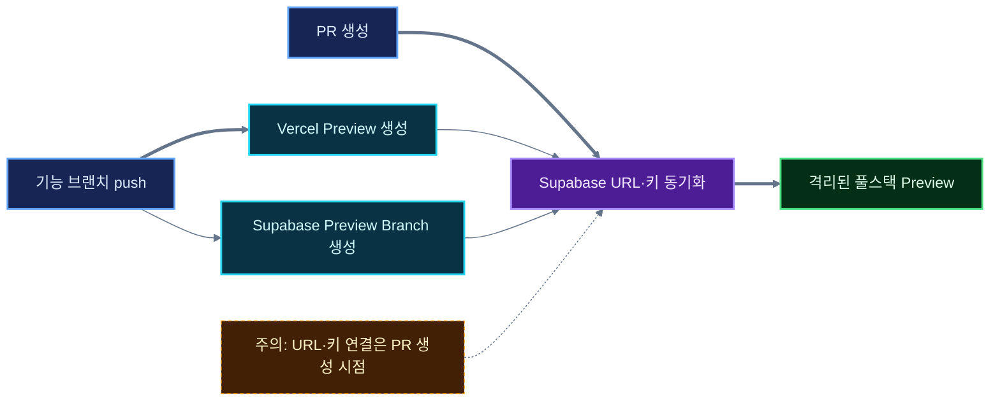
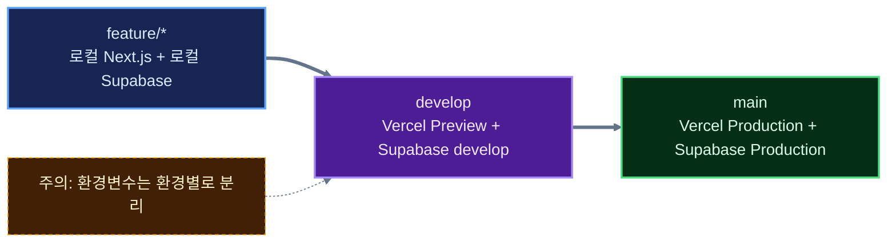

AWS를 사용하면서 테스트 환경은 누군가가 미리 만들어 두어야 하는 인프라라고 생각했다.

서버를 띄우고, 데이터베이스를 준비하고, 배포 파이프라인을 연결하고, 환경변수를 나눈다. 기능 브랜치 하나를 확인하려고 환경을 매번 새로 만드는 경우는 드물었다. 비용과 관리 부담이 너무 크기 때문이다.

그런데 Next.js를 Vercel에, PostgreSQL 기반 백엔드를 Supabase에 두고 브랜치 기능을 살펴보다가 전혀 다른 흐름을 알게 됐다.

Git 브랜치를 push하면 웹 Preview가 생기고, Supabase에도 독립된 Preview Branch가 생긴다. PR을 열면 두 환경의 접속 정보가 연결된다. 기능별로 웹과 DB가 함께 격리되는 구조다.

## 먼저 결론

| Git에서 한 일 | Vercel | Supabase |
|---|---|---|
| 기능 브랜치 생성·push | Preview Deployment 생성 | 설정에 따라 같은 이름의 Preview Branch 생성 |
| PR 생성 | PR 전용 Preview URL 제공 | 브랜치 URL과 키를 Vercel에 동기화 |
| 추가 commit push | Preview 재배포 | 미적용 마이그레이션으로 Branch 갱신 |
| PR merge 또는 close | Preview는 기록으로 남음 | 일시적 Preview Branch 자동 삭제 |
| `main` 반영 | Production 배포 | 운영 배포 설정을 켠 경우 미적용 마이그레이션 반영 |

중요한 점은 Vercel과 Supabase가 하나의 서비스를 만드는 것이 아니라는 것이다. 둘은 각자 Preview 환경을 만들고, 연동 기능이 같은 Git 브랜치를 기준으로 접속 정보를 맞춘다.

## push하면 무엇이 생길까?

Vercel에 GitHub 저장소를 연결하면 Production Branch가 아닌 브랜치의 push는 Preview Deployment가 된다. PR을 열기 전에도 웹 Preview URL은 만들어질 수 있다.

Supabase에서 GitHub Integration의 Automatic branching을 켜면 GitHub에 새 브랜치가 생길 때 같은 이름의 Supabase Branch가 생성된다. 이 Branch는 Production과 분리된 데이터베이스와 API 접속 정보를 가진다.

다만 여기까지만으로 웹 Preview가 새 데이터베이스를 바라본다고 생각하면 안 된다. Supabase가 해당 Branch의 URL과 키를 Vercel에 동기화하는 시점은 공식 문서 기준으로 PR이 열릴 때다.

연동 과정에서 Vercel 배포와 환경변수 동기화의 순서가 엇갈릴 수 있다. Supabase는 이를 보완하기 위해 PR의 최신 Vercel 배포를 다시 배포한다.

따라서 흐름을 간단히 구분하면 이렇다.

- push: Vercel Preview와 Supabase Branch가 각각 생성·갱신된다.
- PR 생성: 두 환경을 연결할 접속 정보가 Vercel에 동기화된다.
- 이후 push: 같은 기능 환경이 새 코드와 마이그레이션으로 갱신된다.

## 기능별 DB는 왜 필요할까?

기능 브랜치가 코드만 바꾼다면 Vercel Preview만으로도 충분할 수 있다. 하지만 회원 연동 기능을 개발하면서 사용자 테이블과 제약조건을 바꾼다고 가정해 보자.

공용 개발 DB 하나를 사용하면 아직 검토 중인 마이그레이션이 다른 개발자와 다른 기능에 영향을 줄 수 있다. 롤백도 까다롭다. 기능별 Supabase Branch에서는 해당 기능의 스키마와 테스트 데이터만 독립적으로 검증할 수 있다.

Supabase Preview Branch에는 Production 데이터가 복사되지 않는다. 저장소의 마이그레이션이 적용되고, 필요하면 `seed.sql`로 테스트 데이터를 넣는다. PR을 merge한다고 테스트 데이터가 Production으로 이동하는 것도 아니다. DB의 구조 변경은 마이그레이션으로 반영한다. 연동 설정에 따라 Edge Functions와 선언된 Storage buckets도 배포되므로, 운영 반영 범위를 DB에만 한정해서 이해해서는 안 된다.

이 때문에 DB 변경은 대시보드에서만 고치기보다 마이그레이션 파일로 관리해야 한다.

## `main`과 `develop`을 함께 쓴다면

내가 생각한 흐름은 `feature/* → develop → main`이다. 이 구조에서는 Supabase Branch를 두 종류로 나누면 이해하기 쉽다.

- `feature/*`: PR 검증이 끝나면 삭제되는 일시적 Preview Branch
- `develop`: 계속 유지되는 Persistent Branch
- `main`: 실제 Production

여기에는 한 가지 설정이 더 필요하다. Vercel에서는 `main` 이외의 Git 브랜치가 기본적으로 모두 Preview 환경에 속한다. 따라서 `develop`이 Supabase의 Persistent Branch를 계속 바라보게 하려면 Vercel Preview 환경변수를 `develop` 브랜치에 한정해서 등록해야 한다.

Vercel Pro라면 `staging` 같은 별도 Custom Environment를 만들고 Branch Tracking으로 `develop`을 연결할 수도 있다. Hobby에서는 Preview 환경변수의 Git Branch 범위를 `develop`으로 지정하는 방식이 현실적이다.

## 로컬 개발은 그대로 로컬 DB로 한다

Preview Branch가 생긴다고 로컬 개발 방식까지 바꿀 필요는 없다.

Next.js는 로컬에서 실행하고, Supabase CLI가 Docker로 로컬 데이터베이스를 실행한다. 스키마를 바꾸면 마이그레이션 파일을 만든 뒤 기능 브랜치에 commit한다. push와 PR 이후에는 동일한 마이그레이션이 원격 Supabase Branch에 적용된다.

즉 역할이 나뉜다.

- 로컬 Supabase: 빠른 개발과 반복 테스트
- 기능별 Preview Branch: PR 단위 통합 검증
- Persistent `develop`: 여러 기능이 합쳐진 개발 환경 검증
- Production: `main`에 승인된 변경만 반영

원격 Preview DB에 직접 붙어서 로컬 앱을 실행할 수도 있지만, 평소 개발의 기본값으로 삼을 필요는 없다. 로컬에서 재현하기 어려운 인증 설정이나 통합 상태를 확인할 때 선택적으로 사용하면 된다.

## 환경변수는 자동 승진하지 않는다

Supabase Integration이 동기화하는 접속 정보와 내가 직접 추가한 환경변수는 구분해야 한다.

기능 브랜치에서 외부 API 키 같은 환경변수를 하나 추가했다고 해서 그 값이 `develop`이나 Production으로 자동 복사되지는 않는다. Vercel에서 Preview·브랜치·Production 범위에 맞게 각각 등록해야 한다.

로컬의 `.env.local`도 자동으로 Vercel에 올라가지 않는다. 비밀값을 Git에 commit하지 않는 대신, 배포 환경별 설정을 명시적으로 관리하는 구조다.

## NestJS는 되고 Spring Boot은 안 되는 걸까?

정확히는 절반만 맞는 말이다.

Vercel은 NestJS를 공식 지원한다. 현재 문서에서는 NestJS 앱을 하나의 Vercel Function으로 배포하고 Preview Deployment를 사용할 수 있다고 안내한다.

반면 Vercel Functions의 공식 런타임 목록에는 Java가 없다. 그래서 장시간 실행되는 JVM 서버를 전제로 한 일반적인 Spring Boot 앱을 NestJS와 같은 방식으로 Vercel에 올리는 것은 공식 지원 경로가 아니다.

하지만 이것은 Supabase Branching의 한계가 아니다. Spring Boot도 각 Supabase Branch의 PostgreSQL 연결 문자열과 API 접속 정보를 받아 사용할 수 있다. Spring Boot Preview 서버를 컨테이너 기반 호스팅 등에 별도로 배포하고 Git 브랜치별 환경변수를 연결하면 같은 개념의 워크플로를 만들 수 있다.

차이는 자동화의 접착면이다. Next.js와 NestJS는 Vercel 안에서 Preview 배포까지 자연스럽게 이어지고, Spring Boot은 실행 환경과 연결 자동화를 별도로 구성해야 한다.

## AWS와 비교하며 느낀 차이

AWS에서도 같은 구조를 만들 수 있다. 브랜치마다 컨테이너를 배포하고, 임시 DB를 만들고, DNS와 비밀값을 연결하고, PR 종료 시 자원을 제거하는 파이프라인을 구성하면 된다.

다만 직접 만들어야 할 부분이 많다. Vercel과 Supabase는 이 과정을 제품 기능으로 묶어 두었다. 작은 팀이나 개인 프로젝트에서는 인프라를 설계하는 시간보다 기능을 검증하는 데 집중할 수 있다는 차이가 크다.

물론 공짜로 복잡성이 사라지는 것은 아니다.

- Supabase Preview Branch는 실행 시간에 따라 비용이 발생한다.
- Preview Branch에는 Production 데이터가 없으므로 테스트 데이터를 준비해야 한다.
- 외부 서비스의 OAuth Redirect URL에는 Preview 주소를 고려해야 한다.
- `develop` 같은 장기 환경은 Vercel 환경변수 범위를 직접 맞춰야 한다.
- Vercel Function의 실행 시간·용량·파일 시스템 제약은 별도로 검토해야 한다.

## 내 PR에 적용한다면 무엇으로 연결 성공을 판단할까?

이 글의 Vercel·Supabase 흐름은 공식 기능을 읽고 정리한 설계 관점이다. 이 블로그에 해당 조합의 PR 환경을 구축하고 배포까지 검증했다는 기록은 아니다. 아래는 실제로 도입할 때 내가 사용할 확인 순서다.

웹 주소가 열렸다는 사실만으로 DB까지 격리됐다고 판단하지 않겠다. 먼저 배포 화면의 Git 브랜치와 커밋을 확인하고, Supabase의 해당 브랜치에서 마이그레이션 적용 상태를 확인한다. 그다음 서버가 참조하는 프로젝트 식별자가 그 브랜치의 것인지 대조한다. 연결 문자열이나 비밀 키 전체를 로그에 남길 필요는 없다.

| 관찰 | 다음 판단 |
| --- | --- |
| 웹은 최신인데 새 컬럼이 없음 | 다른 DB를 보는지, 해당 브랜치의 마이그레이션이 실패했는지부터 구분한다 |
| PR을 열기 전과 후의 동작이 다름 | 환경변수 동기화와 재배포가 완료됐는지 확인한다 |
| 미리보기에서 로그인 후 다른 환경으로 이동 | 인증 서비스의 Redirect URL과 앱의 기준 URL을 함께 점검한다 |
| PR을 닫았는데 자원이 남음 | 일시적 브랜치인지 Persistent Branch인지 구분하고 삭제 상태를 확인한다 |

[Supabase 연동 문서](https://supabase.com/docs/guides/deployment/branching/integrations)는 PR을 열 때 환경변수를 동기화하고 배포 순서 문제를 줄이기 위해 최신 Vercel 배포를 다시 실행한다고 설명한다. 따라서 첫 배포 성공과 연결 완료를 같은 사건으로 취급하면 원인을 잘못 찾을 수 있다.

또한 [GitHub 연동 문서](https://supabase.com/docs/guides/deployment/branching/github-integration)에 따르면 후속 커밋은 이미 실행한 마이그레이션 전체가 아니라 **아직 적용하지 않은 마이그레이션**을 실행한다. 파일을 수정했다고 기존 마이그레이션이 다시 실행될 것이라고 기대하지 말아야 한다. 운영 배포 자동화도 별도 설정이므로, 웹과 DB의 확인 항목을 모두 PR 병합 조건에 포함할지 결정해야 한다.

## 내가 이해한 핵심

Vercel Preview는 Git 브랜치의 **코드 실행 환경**을 만들고, Supabase Branching은 같은 브랜치의 **데이터 환경**을 만든다. PR은 두 환경을 연결하고 검토하는 기준점이 된다.

AWS에서 환경은 먼저 만들어 놓고 코드를 배포하는 대상에 가까웠다. 이 워크플로에서는 Git 브랜치가 환경의 생명주기를 결정한다. 브랜치를 만들면 환경이 생기고, 변경을 push하면 함께 갱신되며, PR을 닫으면 일시적 DB 환경이 사라진다.

내게 혁신적으로 느껴진 지점은 새로운 기술 하나가 아니라, 코드 리뷰의 단위와 실행 환경의 단위가 같아졌다는 점이었다.

## 참고 자료

- [Vercel Git Integration](https://vercel.com/docs/git)
- [Vercel Environments](https://vercel.com/docs/deployments/environments)
- [NestJS on Vercel](https://vercel.com/docs/frameworks/backend/nestjs)
- [Vercel Functions Runtimes](https://vercel.com/docs/functions/runtimes)
- [Supabase Branching](https://supabase.com/docs/guides/deployment/branching)
- [Supabase GitHub Integration](https://supabase.com/docs/guides/deployment/branching/github-integration)
- [Supabase Branching Integrations](https://supabase.com/docs/guides/deployment/branching/integrations)
- [Supabase Vercel 환경변수 설명](https://supabase.com/docs/guides/troubleshooting/vercel-integration-environment-variables-not-syncing-for-persistent-git-branches-b9191e)

2026-09-14 보완: PR 환경의 연결 확인 기준과 미적용 마이그레이션의 동작을 보완했다.
