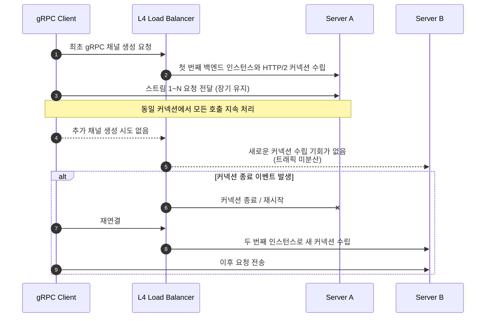
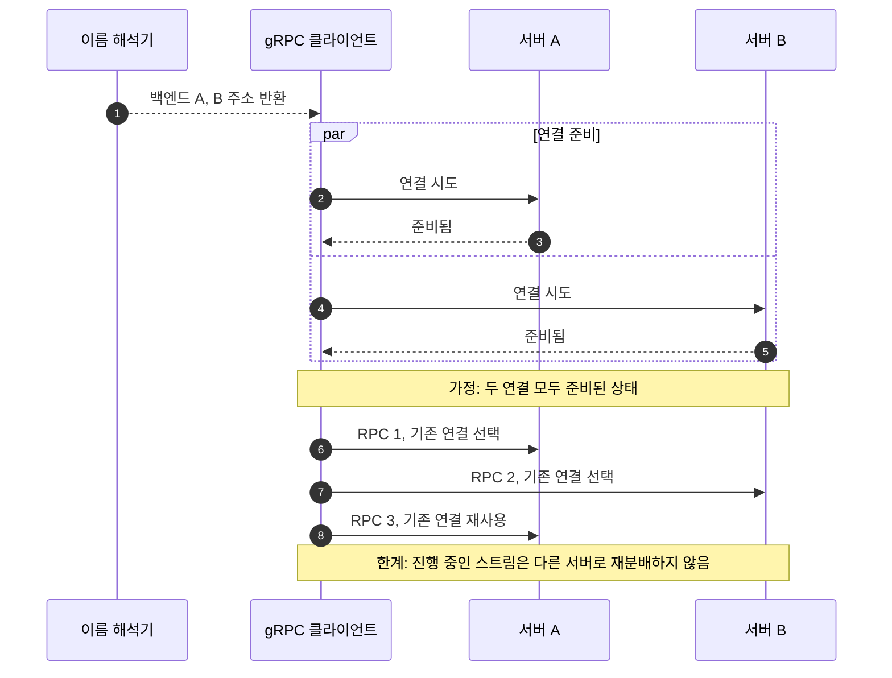

# 이슈

이 글은 당시 장애와 조치를 남긴 기록입니다. 아래 관찰 결과와 일반적인 gRPC 동작 설명은 구분해서 읽어야 합니다. 이번 수정에서는 공식 문서로 정책의 의미를 확인했으며, 과거 로그나 CloudWatch 원본 지표를 다시 확보해 재측정하지는 않았습니다.

파트너스 앱 사용자가 앱 사용이 되지 않는다고 이슈를 보고합니다.

## 현상

gRPC 트래픽이 특정 서버로 편향되어 해당 서버의 CPU 사용률이 높아집니다.
2개의 인스턴스 중 1개의 인스턴스에서만 CPU 사용률이 높습니다.

## 작업 내용

1. gRPC 트래픽이 편향된 서버의 인스턴스를 종료합니다.
2. `src/config/grpc/grpc.config.service.ts`에 `loadBalancingConfig: [{ round_robin: {} }]`와 `dns:///` 스킴을 사용하도록 채널 옵션을 추가하여 gRPC 라운드 로빈 분산 설정을 적용합니다.

## 원인 분석

### 개발환경 테스트 결과

'출조일정', '출조예약', '출조이력' 등 Nest.js 모듈에서 gRPC 트래픽이 일정 시간 동안 특정 서버로 편향됩니다.
일정 시간 이후에는 트래픽이 다른 서버로 변경되기도 하나, 동일한 서버로 트래픽이 전송되기도 합니다.

### gRPC 트래픽 편향 원인

HTTP/2는 한 연결에서 여러 스트림을 처리할 수 있습니다. L4 로드밸런서가 연결 단위로 분산하고 클라이언트가 그 연결을 오래 재사용한다면, 연결이 향한 백엔드에 여러 RPC가 집중될 수 있습니다. gRPC 채널이 항상 연결 하나만 가진다는 뜻은 아닙니다.

당시에는 이 구조를 편향의 원인으로 분석했습니다. 다만 CPU 차이만으로 연결 고착을 확정할 수는 없으므로 이름 해석 결과, 선택된 정책, 서버별 RPC와 연결 상태를 함께 봐야 합니다. 주기적인 재시작이나 채널 재생성이 필수 해결책은 아닙니다.

아래는 L4 뒤의 연결이 한 서버에 유지되는 예시입니다. 재연결 후 다른 서버로 갈 수도 있지만 같은 서버가 다시 선택될 수도 있습니다.



### gRPC `pick_first` 기본 정책 설명

[공식 로드밸런싱 설명](https://grpc.io/docs/guides/custom-load-balancing/)에서 기본 정책인 `pick_first`는 이름 해석기가 준 주소들을 시도해 **연결에 성공한 첫 대상**을 사용합니다. 단순히 DNS 목록의 첫 항목에 반드시 연결한다는 뜻은 아닙니다. 한 연결을 오래 재사용하는 상황에서는 특정 백엔드로 호출이 집중될 수 있습니다.

### gRPC `round_robin` 동작 방식 정리

`round_robin`은 이름 해석 결과의 대상들에 연결을 시도하고, 연결이 준비된 백엔드를 새 RPC마다 순환 선택합니다. 호출할 때마다 연결을 새로 만드는 정책이 아닙니다. 한 대상이 준비되지 않았거나 실패했다면 두 서버의 호출 수가 언제나 정확히 같아지는 것도 아닙니다.

[서비스 설정 공식 문서](https://grpc.io/docs/guides/service-config/)의 정책 형태는 다음과 같습니다. NestJS에서 이를 전달하는 위치는 사용하는 gRPC 라이브러리와 버전의 옵션을 확인해야 합니다.

```json
{
  "loadBalancingConfig": [{ "round_robin": {} }]
}
```

아래 도표는 이름 해석 결과로 두 백엔드 주소를 얻고 두 연결이 모두 준비된 경우입니다. L4 로드밸런서가 RPC마다 대상을 고르는 도표와는 역할이 다릅니다.



`dns:///`는 DNS 해석을 사용하도록 대상을 표현하는 방식이지, 로드밸런서 뒤의 모든 인스턴스를 자동 발견하는 기능은 아닙니다. **클라이언트가 실제로 어떤 주소 목록을 받는지**부터 확인해야 합니다. 로드밸런서 주소만 받는 구성에서 정책 이름만 바꿔도 뒤의 인스턴스가 균등해진다고 단정할 수 없습니다.

또한 [gRPC 성능 문서](https://grpc.io/docs/guides/performance/)가 설명하듯, 스트리밍 RPC는 시작된 뒤 다른 서버로 분산되지 않습니다. 호출 개수가 비슷해도 각 RPC의 처리 비용이나 스트림 수명이 다르면 CPU 사용률은 달라질 수 있습니다.

### keepalive 동작 구조

연결 확인(keepalive)은 HTTP/2 PING으로 연결 상태를 확인하는 기능이며, 호출 분산이나 서비스 자체의 정상 동작 확인을 대신하지 않습니다. 실제 PING 여부는 설정된 주기뿐 아니라 진행 중인 호출이 없는 상태에서도 PING을 허용하는지, 서버가 어떤 정책을 허용하는지에 따라 달라집니다. `keepaliveTimeMs`라는 옵션 이름이 모든 gRPC 구현에서 공통으로 지원된다고 가정해서도 안 됩니다.

[공식 keepalive 문서](https://grpc.io/docs/guides/keepalive/)는 서버와 설정을 조율해야 하며 과도한 PING은 `GOAWAY`와 `too_many_pings`로 거부될 수 있다고 설명합니다. PING 응답 실패로 연결을 닫으면 진행 중인 RPC가 실패할 수 있고, 재연결과 재시도는 별도 정책입니다. 따라서 “keepalive를 켜면 모든 연결이 유지되고 다음 호출은 반드시 다른 서버에 간다”는 보장은 없습니다.

### 당시 기록에 남긴 개선 후 검증 결과

다음 날짜와 수치는 기존 글에 기록한 관찰값입니다. 테스트 요청·환경 설정·원시 로그를 이 글에 첨부하지 못했으므로 독자가 동일 조건으로 재현할 수 있는 성능 자료는 아닙니다. 이번 수정에서 얻은 새 측정값으로 해석해서는 안 됩니다.

- 2025년 10월 10일 테스트 기준, 수정된 gRPC 클라이언트 설정으로 호출 시 두 개의 백엔드 인스턴스에 요청이 번갈아 분산되는 것을 로컬 환경과 개발 환경에서 모두 확인합니다.
- 기존 세션이 특정 인스턴스에 고착되지 않고, 호출 10회 이상 반복 시 응답 비율이 5:5에 근접하게 유지됩니다.
- CPU 사용률 모니터링(CloudWatch)에서도 두 인스턴스가 모두 20% 내외로 균등하게 분담되어, 이전처럼 한쪽만 급격히 상승하는 현상이 재현되지 않습니다.
- 당시에는 연결을 재활용하는 관찰 구간에서도 특정 인스턴스 편중이 재현되지 않았다고 gRPC 로그 확인 결과를 기록했습니다. 모든 장기 세션에서 편중이 없다는 보장은 아닙니다.

## 같은 문제를 만났을 때 남길 근거

다시 진단한다면 응답 비율만 보지 않고 다음을 같은 시간 구간으로 맞춰 기록하겠습니다.

| 확인 대상 | 구분하려는 원인 |
| --- | --- |
| 클라이언트 라이브러리·버전, 적용된 정책 | 설정이 실제 채널에 전달됐는가 |
| DNS 해석 결과와 준비된 연결 수 | 인스턴스 주소를 얻었는가, 한 대상만 연결 가능한가 |
| 서버별 RPC 개수·메서드·지연 | 호출 편향인가, 같은 호출 수에 다른 처리 비용인가 |
| 단일 응답 RPC와 스트리밍 RPC의 비중 | 오래 열린 스트림이 부하를 유지하는가 |
| 재시도·연결 실패·GOAWAY 기록 | 장애나 keepalive 정책이 분산 관찰을 왜곡했는가 |

설정 변경 전후에 같은 호출 종류와 관찰 시간을 사용해야 비교가 가능합니다. 이 항목은 재진단 절차이며 이번 수정에서 새 부하 실험이나 운영 모니터링을 수행한 결과는 아닙니다.

2026-09-14 보완: 공식 연결·분산·keepalive 동작을 정정하고 당시 관측값의 한계를 명시했습니다.
