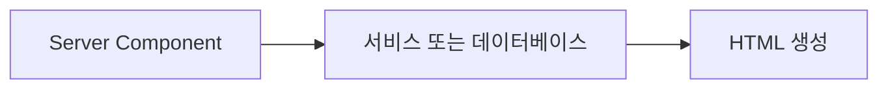
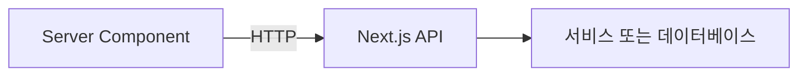
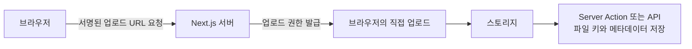

# Next.js Server Action은 API와 무엇이 다를까?

Next.js의 서버 측 렌더링(Server-Side Rendering, SSR)을 공부하면서 처음에는 이렇게 생각했다.

> SSR 쪽은 결국 백엔드에서 실행되는 코드다.  
> 그렇다면 필요한 API를 만들고, 화면에서 그 API를 호출하면 되는 것 아닌가?

틀린 생각은 아니다.

Next.js에서도 API를 만들 수 있고, 브라우저에서 그 API를 호출할 수 있다. 실제로 외부 클라이언트가 접근해야 하거나 명시적인 HTTP 계약이 필요하다면 이 방식이 적합하다.

그런데 App Router에는 API 외에도 Server Component와 Server Action이라는 서버 코드 실행 방식이 있다.

세 방식 모두 서버에서 코드를 실행할 수 있지만, **서버 코드를 어떤 경로로 호출하느냐**가 다르다.

## 먼저 결론부터 정리하면

Next.js App Router에서 서버 코드를 실행하는 주요 방식은 다음과 같이 구분할 수 있다.

| 방식 | 주된 목적 | 호출 방식 |
|---|---|---|
| Server Component | 화면 렌더링에 필요한 데이터 조회 | Next.js가 페이지를 렌더링하면서 실행 |
| Server Action | 현재 Next.js 화면에서 발생한 데이터 변경 | React 컴포넌트에서 함수처럼 호출 |
| Route Handler | 명시적인 HTTP API 제공 | `fetch`, 앱, 외부 서비스가 URL로 호출 |

가장 중요한 차이는 다음과 같다.

> Server Action은 API가 할 일을 못 하는 새로운 백엔드가 아니다.  
> Next.js 화면과 서버 코드 사이의 호출을 프레임워크가 대신 연결해 주는 방식이다.

## SSR과 백엔드 API는 같은 개념이 아니다

SSR은 HTML을 서버에서 생성하는 렌더링 방식이다.

반면 API는 클라이언트와 서버가 HTTP 요청과 응답으로 통신하기 위한 인터페이스다.

둘 다 서버 코드를 사용하기 때문에 비슷하게 느껴지지만 관심사가 다르다.

- SSR은 HTML을 어디에서 만들 것인지에 관한 문제다.
- API는 서버 기능을 어떤 인터페이스로 공개할 것인지에 관한 문제다.

Next.js의 Server Component는 서버에서 화면을 렌더링한다. 이때 필요한 데이터를 가져오기 위해 반드시 자기 자신의 API를 호출할 필요는 없다.

```tsx
// app/posts/page.tsx
import { db } from "@/lib/db";

export default async function PostsPage() {
  const posts = await db.post.findMany({
    orderBy: {
      createdAt: "desc",
    },
  });

  return (
    <main>
      {posts.map((post) => (
        <article key={post.id}>{post.title}</article>
      ))}
    </main>
  );
}
```

이 코드는 서버에서만 실행된다.

따라서 같은 애플리케이션의 API를 다시 호출하지 않고 데이터베이스나 서버 서비스를 직접 사용할 수 있다.



자기 애플리케이션의 API를 다시 호출하는 방식도 가능하지만 다음 단계가 추가된다.



인증, 캐시 또는 아키텍처 경계를 위해 API 호출이 필요한 경우도 있다. 하지만 단순히 서버 렌더링에 필요한 데이터를 읽는 것이라면 내부 함수를 직접 호출하는 편이 더 단순하다.

## API를 만들면 어떻게 실행되는가?

App Router에서는 `route.ts` 파일로 Route Handler를 만든다.

```ts
// app/api/posts/route.ts
import { NextResponse } from "next/server";
import { db } from "@/lib/db";

export async function GET() {
  const posts = await db.post.findMany({
    orderBy: {
      createdAt: "desc",
    },
  });

  return NextResponse.json(posts);
}
```

이제 브라우저나 다른 클라이언트가 다음 주소를 호출할 수 있다.

```text
GET /api/posts
```

클라이언트 컴포넌트에서는 일반적인 API와 동일하게 `fetch`를 사용한다.

```tsx
"use client";

import { useEffect, useState } from "react";

type Post = {
  id: string;
  title: string;
};

export default function PostsClient() {
  const [posts, setPosts] = useState<Post[]>([]);

  useEffect(() => {
    fetch("/api/posts")
      .then((response) => response.json())
      .then(setPosts);
  }, []);

  return (
    <ul>
      {posts.map((post) => (
        <li key={post.id}>{post.title}</li>
      ))}
    </ul>
  );
}
```

이 방식에는 명시적인 HTTP 계약이 있다.

- 요청 주소
- HTTP 메서드
- 헤더
- 요청 본문
- 상태 코드
- 응답 JSON

다른 웹사이트, 모바일 앱, 웹훅 또는 외부 서비스도 같은 API를 호출할 수 있다.

## Server Action은 무엇인가?

Server Action은 서버에서 실행되는 비동기 함수다.

함수 내부나 파일 상단에 `"use server"`를 선언한다. [Next.js 변경 작업 문서](https://nextjs.org/docs/app/getting-started/mutating-data)는 이 서버 함수를 폼이나 이벤트에 연결하는 방식을 설명한다.

아래 DB 예제는 호출 구조에 집중하기 위해 인증과 권한 구현을 생략했다. 실제 공개 쓰기 기능에서는 서버가 현재 사용자를 확인한 뒤 실행해야 한다.

```ts
// app/posts/actions.ts
"use server";

import { revalidatePath } from "next/cache";
import { db } from "@/lib/db";

export async function createPost(formData: FormData) {
  const rawTitle = formData.get("title");
  if (typeof rawTitle !== "string") {
    throw new TypeError("제목은 문자열이어야 합니다.");
  }
  const title = rawTitle.trim();

  if (!title) {
    throw new Error("제목을 입력해주세요.");
  }

  await db.post.create({
    data: {
      title,
    },
  });

  revalidatePath("/posts");
}
```

이 함수는 `<form>`에 직접 연결할 수 있다.

```tsx
import { createPost } from "./actions";

export default function PostForm() {
  return (
    <form action={createPost}>
      <input name="title" />
      <button type="submit">글 작성</button>
    </form>
  );
}
```

겉으로 보면 브라우저에서 서버 함수를 직접 실행하는 것처럼 보인다.

하지만 실제로 함수 코드가 브라우저로 전달되어 실행되는 것은 아니다.

Next.js가 다음 과정을 연결한다.


개발자는 URL, 요청 본문 변환, 응답 처리 같은 통신 코드를 직접 작성하지 않고 서버 함수를 React 컴포넌트에 연결한다.

그래서 Server Action은 다음과 같이 이해하는 편이 쉽다.

> Next.js 화면에서 사용할 수 있도록 프레임워크가 연결해 주는 서버 함수 호출 방식

## Server Action은 폼에서만 사용할 수 있을까?

아니다.

폼과 결합했을 때 사용하기 편하지만 버튼 클릭이나 다른 이벤트에서도 호출할 수 있다.

```tsx
"use client";

import { useTransition } from "react";
import { deletePost } from "./actions";

export function DeletePostButton({ postId }: { postId: string }) {
  const [isPending, startTransition] = useTransition();

  function handleDelete() {
    startTransition(async () => {
      await deletePost(postId);
    });
  }

  return (
    <button onClick={handleDelete} disabled={isPending}>
      {isPending ? "삭제 중..." : "삭제"}
    </button>
  );
}
```

즉, Server Action은 예전 HTML 폼 제출만을 위한 기능이 아니다.

다만 폼과 결합하면 자바스크립트가 완전히 준비되기 전에도 제출할 수 있는 점진적 향상(progressive enhancement)을 활용할 수 있다.

## 같은 기능을 API로 만들면 어떻게 달라질까?

글 작성 기능을 Route Handler로 구현하면 다음과 같이 작성할 수 있다.

```ts
// app/api/posts/route.ts
import { NextResponse } from "next/server";
import { db } from "@/lib/db";

export async function POST(request: Request) {
  let body;
  try {
    body = await request.json();
  } catch {
    return NextResponse.json({ message: "올바른 JSON이 필요합니다." }, { status: 400 });
  }
  if (typeof body !== "object" || body === null || Array.isArray(body) || typeof body.title !== "string") {
    return NextResponse.json({ message: "제목은 문자열이어야 합니다." }, { status: 400 });
  }
  const title = body.title.trim();

  if (!title) {
    return NextResponse.json(
      { message: "제목을 입력해주세요." },
      { status: 400 },
    );
  }

  const post = await db.post.create({
    data: {
      title,
    },
  });

  return NextResponse.json(post, {
    status: 201,
  });
}
```

클라이언트에서는 요청 코드를 직접 작성한다.

```tsx
"use client";

import { useState } from "react";

export default function PostForm() {
  const [title, setTitle] = useState("");

  async function handleSubmit(event: React.FormEvent) {
    event.preventDefault();

    const response = await fetch("/api/posts", {
      method: "POST",
      headers: {
        "Content-Type": "application/json",
      },
      body: JSON.stringify({
        title,
      }),
    });

    if (!response.ok) {
      const error = await response.json();
      throw new Error(error.message);
    }
  }

  return (
    <form onSubmit={handleSubmit}>
      <input
        value={title}
        onChange={(event) => setTitle(event.target.value)}
      />
      <button type="submit">글 작성</button>
    </form>
  );
}
```

두 방식 모두 결국 서버에서 데이터베이스에 글을 저장한다.

차이는 기능보다 인터페이스에 있다.

### Server Action


### Route Handler


## Server Action과 API 비교

| 항목 | Server Action | Route Handler API |
|---|---|---|
| 호출 대상 | 주로 현재 Next.js 애플리케이션 | 브라우저, 앱, 외부 서비스 |
| 호출 방법 | 서버 함수 import 후 호출 | URL과 HTTP 메서드로 호출 |
| 요청 코드 | Next.js가 대부분 처리 | `fetch` 등을 직접 작성 |
| HTTP 계약 | 프레임워크 내부에 가까움 | URL, 메서드, 상태 코드가 명확함 |
| 외부 클라이언트 사용 | 적합하지 않음 | 적합함 |
| 폼 연결 | 간단함 | 제출 처리 코드를 작성해야 함 |
| 캐시 갱신 | `revalidatePath` 등을 함께 사용하기 편함 | 별도로 설계해야 함 |
| 재사용 범위 | Next.js 화면 중심 | 여러 클라이언트가 공유 가능 |
| 버전 결합도 | React와 Next.js에 강하게 결합 | HTTP 계약을 기준으로 분리 가능 |

## 언제 Server Action을 사용하면 좋을까?

다음 조건이라면 Server Action이 잘 맞는다.

- 현재 Next.js 웹 화면에서만 사용하는 기능
- 폼 제출이나 버튼 클릭으로 데이터가 변경되는 기능
- 별도의 공개 API 계약이 필요하지 않은 기능
- 저장 후 현재 페이지의 캐시를 갱신해야 하는 기능
- 관리자 페이지의 간단한 생성·수정·삭제 기능

예를 들면 게시글 초안 저장, 댓글 작성, 사용자 프로필 수정, 관리자 화면의 공개 상태 변경 등이 있다.

## 언제 API가 더 적합할까?

다음 조건이라면 Route Handler와 같은 명시적인 API가 필요하다.

- 모바일 앱도 같은 기능을 호출해야 하는 경우
- 다른 웹사이트나 서비스가 호출해야 하는 경우
- 결제사나 외부 서비스의 웹훅을 받아야 하는 경우
- 안정적인 URL과 요청·응답 계약이 필요한 경우
- 외부에 API 문서를 제공해야 하는 경우
- 클라이언트와 서버를 독립적으로 배포해야 하는 경우

결제 완료 웹훅, 소셜 로그인 콜백, 외부 파트너 연동 API 등이 대표적이다.

## 조회라면 무조건 API를 만들어야 할까?

Server Component에서 화면 렌더링을 위해 조회하는 데이터라면 API가 필요하지 않을 수 있다.

```tsx
export default async function PostPage({
  params,
}: {
  params: Promise<{ id: string }>;
}) {
  const { id } = await params;
  const post = await getPost(id);

  return <article>{post.title}</article>;
}
```

정리하면 다음 기준이 유용하다.

- 최초 화면 렌더링에 필요한 조회: Server Component
- 현재 화면에서 발생하는 데이터 변경: Server Action
- 외부에서도 호출 가능한 HTTP 인터페이스: Route Handler
- 브라우저에서 반복적으로 호출하는 조회: API 또는 클라이언트 데이터 조회 계층

이 구분은 절대적인 규칙은 아니지만 출발점으로 사용하기 좋다.

## Vercel Function과는 무슨 관계일까?

Next.js의 Route Handler나 Server Action을 Vercel에 배포하면 해당 서버 코드는 Vercel의 서버 실행 환경에서 동작한다.

그렇다고 Next.js API와 Vercel Function이 서로 다른 두 개의 코드를 의미하는 것은 아니다.


정리하면 다음과 같다.

- Route Handler와 Server Action은 애플리케이션 코드의 작성 방식이다.
- Vercel Function은 해당 서버 코드가 배포되어 실행되는 환경이다.
- Next.js를 자체 서버에 배포하면 같은 코드가 Vercel Function이 아니라 해당 Node.js 서버에서 실행될 수 있다.

## Server Action도 보안 검사가 필요하다

Server Action이 함수처럼 보인다고 해서 신뢰할 수 있는 내부 함수가 되는 것은 아니다.

브라우저에서 요청할 수 있는 서버 진입점이기 때문에 API와 동일하게 다음 검사가 필요하다.

- 로그인 여부 확인
- 사용자 권한 확인
- 입력값 검증
- 접근 가능한 데이터 범위 확인
- 중복 요청 방지
- 중요한 작업의 감사 로그 기록

클라이언트가 전달한 사용자 식별자나 권한 값을 그대로 믿어서는 안 된다. 서버가 현재 세션과 데이터베이스를 기준으로 다시 확인해야 한다.

## 입력 검증은 호출 방식보다 먼저: 문자열 변환의 함정

앞의 글 작성 코드는 호출 경로를 보여주기 위해 DB 연결과 인증 구현을 생략한 예제다. 그대로 공개 쓰기 기능에 붙이기 전에 현재 세션의 권한과 입력을 검사해야 한다. [Next.js 데이터 보안 문서](https://nextjs.org/docs/app/guides/data-security)도 Server Action을 공개 HTTP 진입점처럼 취급하고 각 함수에서 권한을 확인하라고 설명한다.

여기서 작은 차이 하나를 직접 확인했다. `String(formData.get("title"))`는 파일도 문자열로 바꾸므로 “비어 있지 않다”는 검사만으로 제목을 검증할 수 없다. JSON으로 받는 API도 숫자를 문자열로 자동 변환하면 의도하지 않은 입력을 허용할 수 있다.

이번 수정에서는 Node.js v24.9.0의 실제 `FormData`와 `File`을 사용해 다음 함수를 실행했다. 별도 패키지는 필요 없다.

```js
function parseTitle(value) {
  if (typeof value !== 'string') {
    throw new TypeError('제목은 문자열이어야 합니다.');
  }
  const title = value.trim();
  if (!title) throw new Error('제목을 입력해주세요.');
  return title;
}

const form = new FormData();
form.set('title', '  검증 예제  ');
console.log(parseTitle(form.get('title'))); // 검증 예제

form.set('title', new File(['본문'], 'title.txt'));
console.log(String(form.get('title'))); // [object File]
parseTitle(form.get('title')); // TypeError
```

문자열은 공백 제거 후 반환됐고, 누락값·숫자·파일·공백 문자열은 검사에서 거절됐다. Server Action에서는 `formData.get('title')`, JSON API에서는 파싱한 객체의 `title`을 같은 규칙으로 검증할 수 있다. API 쪽은 잘못된 JSON과 객체가 아닌 본문도 별도로 처리해야 한다.

이 실행은 **입력 검증 함수의 결과**를 확인한 것이다. Next.js의 실제 Action 요청, 로그인, DB 저장, 캐시 갱신까지 검증한 결과는 아니다. 기능을 통합할 때는 로그아웃 상태의 호출과 다른 사용자의 데이터 변경이 각각 거절되는지 확인해야 한다. 호출 코드를 줄여도 그 책임은 줄어들지 않는다.

## 큰 파일을 Server Action으로 업로드해야 할까?

이미지처럼 큰 파일을 업로드할 때는 Server Action을 무조건 거치는 구조가 적합하지 않을 수 있다.

Server Action의 요청 본문 크기에는 제한이 있으며, 큰 파일을 애플리케이션 서버가 중계하면 서버 실행 시간과 네트워크 사용량도 증가한다.

이미지 저장소가 직접 업로드를 지원한다면 다음 구조를 고려할 수 있다.



이 경우 Server Action에는 실제 이미지 파일 전체가 아니라 이미지 식별자, 저장소 키, 가로·세로 크기 같은 작은 데이터만 전달한다.

반면 업로드 URL 발급, 외부 이미지 처리 완료 통지, 웹훅처럼 명시적인 HTTP 호출이 필요한 부분은 Route Handler가 더 자연스럽다.

## 내가 이해한 핵심

처음에는 SSR을 백엔드와 동일한 개념으로 생각했다.

그래서 서버에서 필요한 기능이 있다면 항상 API부터 만들고, 서버 화면에서도 그 API를 호출해야 한다고 생각했다.

하지만 Next.js App Router에서는 서버 코드로 들어가는 경로가 나뉜다.

- 화면을 렌더링하면서 데이터를 읽는 Server Component
- 현재 화면의 데이터 변경을 처리하는 Server Action
- 명시적인 HTTP 계약을 제공하는 Route Handler

세 방식 중 하나가 무조건 더 좋은 것은 아니다.

중요한 것은 기능이 실행되는 위치보다 **누가, 어떤 인터페이스로 호출해야 하는지**다.

> Next.js 내부 화면에서만 사용하는 변경 작업이라면 Server Action이 단순할 수 있다.  
> 여러 클라이언트가 공유해야 하는 기능이라면 API가 더 적합하다.  
> 서버 렌더링에 필요한 조회라면 자기 API를 다시 호출하지 않아도 된다.

Server Action은 API를 없애는 기능이 아니다.

필요한 곳에는 API를 두고, 현재 Next.js 화면에서만 필요한 작업은 더 직접적으로 서버 함수에 연결할 수 있게 해주는 선택지다.

## 참고 자료

- [Next.js Server Functions and Mutations](https://nextjs.org/docs/app/getting-started/mutating-data)
- [Next.js Route Handlers](https://nextjs.org/docs/app/getting-started/route-handlers)
- [Next.js Data Fetching](https://nextjs.org/docs/app/getting-started/fetching-data)
- [Next.js Backend for Frontend](https://nextjs.org/docs/app/guides/backend-for-frontend)
- [Next.js Data Security](https://nextjs.org/docs/app/guides/data-security)

2026-09-14 보완: 입력 자료형 검증 예제와 실제 실행 범위를 보완했다.
