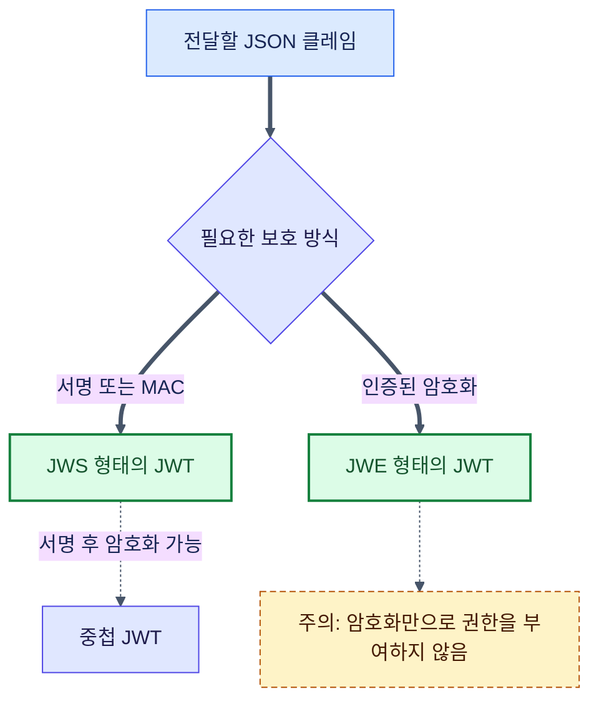
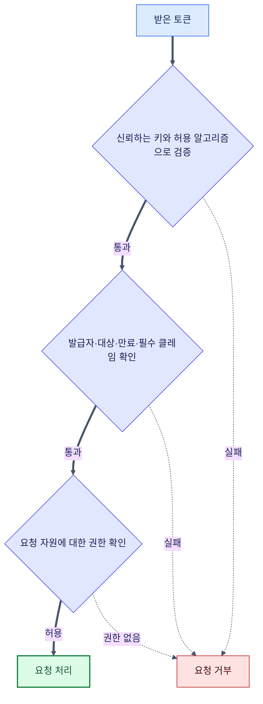
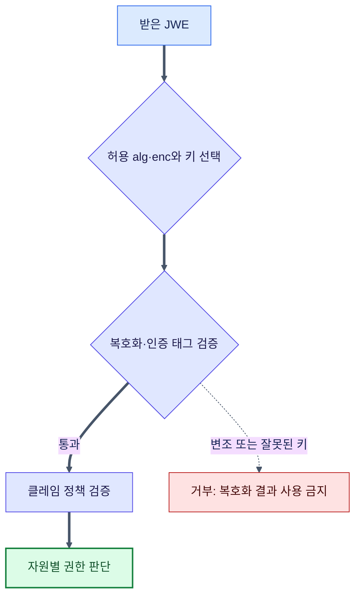

# JWT와 JWE의 차이점

2026년 9월 14일 규격을 다시 확인해 JWT를 서명 방식으로만 설명했던 부분과, 검증·복호화 성공을 곧바로 인증 성공으로 표시했던 도표를 바로잡았습니다.

JWT를 쓰면 내용이 보이고 JWE를 쓰면 내용이 숨겨진다는 설명은, 흔히 쓰는 **서명된 JWT와 암호화된 JWT**를 비교할 때에는 도움이 됩니다. 하지만 JWT 자체가 서명 방식을 뜻하지는 않습니다. JWT는 JSON 클레임을 전달하는 토큰 형식이고, 그 클레임을 JWS 또는 JWE 형태로 표현할 수 있습니다. 서명 후 암호화하는 중첩 JWT도 가능합니다. [RFC 7519의 정의와 개요](https://www.rfc-editor.org/rfc/rfc7519.html#section-3)를 기준으로 관계부터 구분하겠습니다.

## JWT, JWS, JWE의 관계



## JWS 형태의 JWT: 내용은 읽을 수 있고, 변경은 검출합니다

JWS는 디지털 서명 또는 메시지 인증 코드(MAC)로 무결성을 보호합니다. HS256은 공유 비밀키를 사용하는 MAC이고, ES256·RS256처럼 개인키로 서명하고 공개키로 검증하는 방식도 있습니다. 따라서 “시크릿 키로만 서명한다”는 설명은 모든 JWS에 해당하지 않습니다. [JWS 규격](https://www.rfc-editor.org/rfc/rfc7515.html)

일반적인 JWT의 JWS 압축 표현은 세 부분입니다.

```text
header.payload.signature
```

- 헤더(header): 알고리즘과 토큰 유형 등 보호 관련 정보입니다.
- 본문(payload): JSON 클레임을 Base64url로 인코딩한 값입니다.
- 서명(signature): 앞의 두 부분에 대한 서명 또는 MAC입니다.

Base64url은 암호화가 아니므로 토큰을 가진 사람은 본문을 읽을 수 있습니다. 토큰 문자열을 수정하는 것 자체도 가능합니다. 중요한 보장은 **신뢰하는 키와 허용 알고리즘으로 올바르게 검증하면, 서명을 다시 만들 수 없는 공격자의 변경을 검출한다**는 것입니다. 원래 토큰을 훔쳐 그대로 재사용하는 공격까지 막아 주는 것은 아닙니다.



서명 검증은 인증·인가 절차의 한 부분입니다. 유효한 사용자 토큰이어도 다른 사용자의 예약을 수정할 수 있는지는 서버가 따로 판단해야 합니다. `decode`로 읽은 `sub`나 `role`만 믿어서는 안 됩니다. 발급자(iss), 수신 대상(aud), 만료(exp), 허용 알고리즘을 서비스 정책으로 고정하고, 서로 다른 용도의 토큰을 혼용하지 않습니다. [JWT 보안 권고 RFC 8725](https://www.rfc-editor.org/rfc/rfc8725.html)

## JWE 형태의 JWT: 클레임을 암호화합니다

JWE는 클레임의 기밀성과 암호문 무결성을 보호합니다. 복호화 키를 가진 수신자는 내용을 볼 수 있으므로 “아무도 볼 수 없다”는 뜻은 아닙니다. 보호된 헤더도 일반적으로 읽을 수 있으니 거기에 비밀을 넣으면 안 됩니다. [JWE 규격](https://www.rfc-editor.org/rfc/rfc7516.html)

압축 표현은 다섯 부분입니다.

```text
header.encrypted_key.iv.ciphertext.tag
```

- 헤더(header): 키 관리 알고리즘(alg)과 콘텐츠 암호화 알고리즘(enc) 등입니다.
- 암호화된 키(encrypted_key): 콘텐츠 암호화 키를 감싼 값입니다. 직접 키를 공유하는 `dir`에서는 빈 부분입니다.
- 초기화 벡터(iv): 암호화에 사용하는 값입니다.
- 암호문(ciphertext): 암호화한 본문입니다.
- 인증 태그(tag): 암호문 무결성을 확인하는 값입니다.



암호화되었다고 신뢰하는 발급자가 만든 토큰이라는 결론이 자동으로 나오지는 않습니다. 예를 들어 수신자의 공개키는 다른 사람도 사용할 수 있습니다. 발급자 인증이 필요한 설계에서는 서명과 암호화의 조합, 키 소유 관계와 클레임 검증 정책을 함께 정해야 합니다. JWE를 쓰더라도 토큰에 저장할 개인정보는 최소화하고 HTTPS, 키 보관·교체, 만료와 폐기 정책을 적용합니다.

## 이번 수정에서 실행해 확인한 예제

아래는 과거 운영 경험이 아닌, 이번 글을 수정하며 로컬에서 실행한 검증 예제입니다. Node.js 24.9.0과 `jose` 6.2.12를 사용했습니다. 실제 사용자나 운영 키 대신 실행할 때 생성하는 키와 예제 전용 클레임을 사용합니다. 토큰·키를 출력하거나 외부로 전송하지 않습니다.

별도 빈 디렉터리에서 아래 명령으로 의존성을 설치하고, 이어지는 코드를 `jwtExample.mjs`로 저장해 실행할 수 있습니다.

```sh
npm init -y
npm install --save-exact jose@6.2.12
node jwtExample.mjs
```

```js
import assert from 'node:assert/strict';
import { generateKeyPair, SignJWT, jwtVerify, EncryptJWT, jwtDecrypt } from 'jose';

// 이번 글의 검증 예제 전용 키와 클레임이며 운영 계정·키를 사용하지 않습니다.
const { privateKey, publicKey } = await generateKeyPair('ES256');
const encryptionKey = crypto.getRandomValues(new Uint8Array(32));
const issuer = 'urn:example:article-issuer';
const audience = 'urn:example:article-reader';
const options = { issuer, audience, algorithms: ['ES256'],
  requiredClaims: ['iss', 'aud', 'sub', 'exp', 'iat'], typ: 'JWT' };
const token = await new SignJWT({ purpose: 'article-verification' })
  .setProtectedHeader({ alg: 'ES256', typ: 'JWT' })
  .setIssuer(issuer).setAudience(audience).setSubject('article-example')
  .setIssuedAt().setExpirationTime('2m').sign(privateKey);
const verified = await jwtVerify(token, publicKey, options);
assert.equal(verified.payload.sub, 'article-example');
const parts = token.split('.');
const decoded = JSON.parse(Buffer.from(parts[1], 'base64url').toString());
assert.equal(decoded.purpose, 'article-verification'); // 디코딩은 검증이 아닙니다.
parts[1] = Buffer.from(JSON.stringify({ ...decoded, sub: 'changed' })).toString('base64url');
await assert.rejects(jwtVerify(parts.join('.'), publicKey, options), { code: 'ERR_JWS_SIGNATURE_VERIFICATION_FAILED' });
await assert.rejects(jwtVerify(token, publicKey, { ...options, audience: 'urn:example:other-reader' }), { code: 'ERR_JWT_CLAIM_VALIDATION_FAILED' });
await assert.rejects(jwtVerify(token, publicKey, { ...options, currentDate: new Date((verified.payload.exp + 1) * 1000) }), { code: 'ERR_JWT_EXPIRED' });
const encrypted = await new EncryptJWT({ purpose: 'article-verification' })
  .setProtectedHeader({ alg: 'dir', enc: 'A256GCM', typ: 'JWT' })
  .setIssuer(issuer).setAudience(audience).setSubject('article-example')
  .setIssuedAt().setExpirationTime('2m').encrypt(encryptionKey);
const decryptOptions = { issuer, audience, typ: 'JWT',
  requiredClaims: ['iss', 'aud', 'sub', 'exp', 'iat'],
  keyManagementAlgorithms: ['dir'], contentEncryptionAlgorithms: ['A256GCM'] };
assert.equal((await jwtDecrypt(encrypted, encryptionKey, decryptOptions)).payload.sub, 'article-example');
const encryptedParts = encrypted.split('.');
assert.equal(encryptedParts.length, 5);
assert.equal(encryptedParts[1], '');
const ciphertext = Buffer.from(encryptedParts[3], 'base64url');
ciphertext[0] ^= 1;
encryptedParts[3] = ciphertext.toString('base64url');
await assert.rejects(jwtDecrypt(encryptedParts.join('.'), encryptionKey, decryptOptions), { code: 'ERR_JWE_DECRYPTION_FAILED' });
console.log('통과: JWS 검증·디코딩, 변조/대상/만료 거부, JWE 복호화·변조 거부');
```

정상 JWS와 JWE는 검증을 통과했고, 서명된 본문 변경·다른 수신 대상·만료 시각 이후 검증·JWE 암호문 변경은 각각 거부되었습니다. 이 예제는 토큰 검증만 다룹니다. 로그인 세션 저장, 키 배포, 토큰 폐기와 예약 소유권 검사는 구현하지 않았습니다. 라이브러리 API는 [jose 공식 저장소](https://github.com/panva/jose)를 참고했습니다.

## 비교와 선택 기준

| 항목 | JWS 형태의 JWT | JWE 형태의 JWT |
| --- | --- | --- |
| 주된 보호 | 서명 또는 MAC으로 변경 검출 | 암호화로 내용 보호, 인증 태그로 변경 검출 |
| 본문 공개 여부 | 토큰 소지자가 읽을 수 있음 | 복호화 키가 필요함 |
| 압축 표현 | 3개 부분 | 5개 부분, 일부는 비어 있을 수 있음 |
| 키 설계 | 공유 비밀 또는 비대칭 키 | 키 관리 방식과 콘텐츠 암호화 방식을 함께 선택 |
| 길이·성능 | 알고리즘·클레임 크기에 따라 다름 | 알고리즘·클레임 크기에 따라 다름, 직접 측정 필요 |
| 판단 기준 | 본문 공개가 허용되고 신뢰하는 발급자의 클레임을 검증할 때 | 중간 전달자나 토큰 소지자에게 클레임을 숨겨야 할 때 |

라이브러리도 구분해야 합니다. `jsonwebtoken`은 JWT 서명·검증에, `passport-jwt`는 Passport 인증 전략 연결에 쓰이며 JWE 복호화를 대신하지 않습니다. `jose`는 JWS/JWE를 지원합니다. NextAuth.js/Auth.js는 JWT 세션 전략에서 암호화된 JWT를 사용하지만 데이터베이스 세션 등 설정에 따라 동작이 다르므로, 모든 세션이 JWE라고 가정하지 않습니다. [Auth.js JWT 문서](https://authjs.dev/reference/core/jwt)

예를 들어 사용자 식별자만 담는 API 토큰이라면 JWS 검증과 서버의 자원별 권한 확인부터 설계할 수 있습니다. 개인정보를 감춰야 한다면 먼저 그 값을 토큰에 넣을 필요가 있는지 검토하고, 꼭 전달해야 할 때 수신자 키 관리와 함께 JWE를 고려합니다. 암호화 여부만으로 인증 방식의 안전성을 판정하지 않는 것이 핵심입니다.
