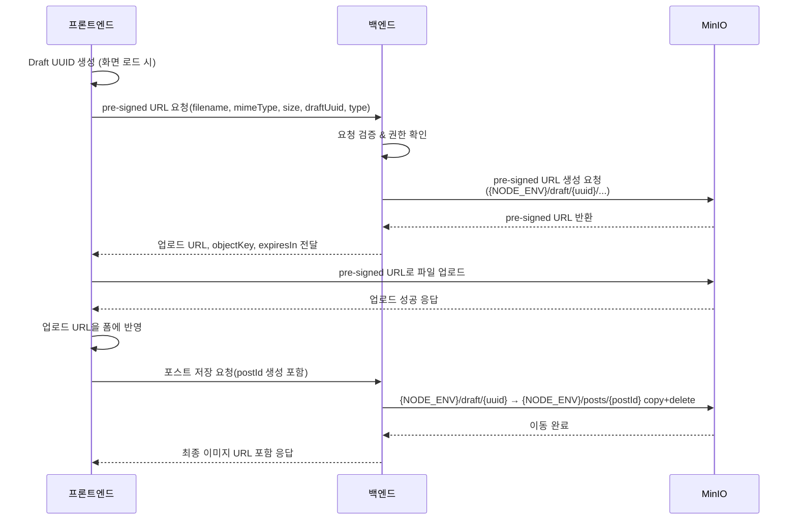

# 요구사항

## 기능 개요

- 관리자 포스트 작성 시 이미지 URL을 직접 붙여 넣는 현재 방식 대신, Railway MinIO에 이미지를 업로드하고 업로드 결과 URL을 자동으로 채워 주는 업로드 기능을 제공한다.
- 업로드 과정은 백엔드에서 MinIO를 대신 호출하도록 하여 자격 증명을 노출하지 않고, 관리자 UX와 운영 관리를 동시에 개선한다.

## 용어 정의

- **MinIO**: Railway에 구축된 S3 호환 오브젝트 스토리지.
- **pre-signed URL**: 특정 객체에 대해 제한된 시간 동안 유효한 업로드 URL.
- **Draft UUID**: 최종 포스트 ID가 아직 없을 때 임시로 사용할 고유 식별자.
- **썸네일**: 관리자 포스트 목록/상세에 노출될 대표 이미지.

## 현재 상황

- Railway에 MinIO가 이미 세팅되어 있으며 user/password(=accessKey/secretKey)와 endpoint 정보를 보유하고 있다.
- 관리자 화면에는 이미지 URL 입력 필드가 존재하지만, 실제 파일 업로드 기능은 없다.

## 접속 정보

- public endpoint: <https://bucket-production-d421.up.railway.app:443>
- private endpoint: <http://bucket.railway.internal:9000>

## 시스템 흐름

### 업무 플로우



1. 프론트엔드는 화면이 로드될 때 Draft UUID를 생성하고 유지한다.
2. 관리자가 파일을 선택하면 프론트엔드는 백엔드 pre-signed URL API에 파일 메타(원본 파일명, MIME, 바이트 크기)를 전달한다.
3. 백엔드는 요청을 검증한 뒤 MinIO SDK를 사용해 `{NODE_ENV}/draft/{uuid}/` 경로(dev 환경은 `development`, prod 환경은 `production` 등)로 pre-signed PUT URL을 생성하여 프론트엔드에 반환한다.
4. 프론트엔드는 반환받은 pre-signed URL로 파일을 업로드하고, 성공 시 업로드된 객체의 공개 URL을 백엔드에서 받은 정보로 구성한다.
5. 프론트엔드는 업로드 결과 URL을 포스트 작성 폼의 이미지 입력값에 자동 주입한다.
6. 포스트 저장이 완료되면 백엔드는 `{NODE_ENV}/draft/{uuid}/` 아래 객체들을 `{NODE_ENV}/posts/{postId}/` 폴더로 복사(copy)한 뒤 원본을 삭제(delete)하여 최종 URL을 갱신한다.

> `{NODE_ENV}`는 현재 프로필에서 전달되는 실행 환경(`development`, `production` 등)을 그대로 Prefix로 사용한다.

### 파일명/폴더 규칙

- 임시 업로드: `{NODE_ENV}/draft/{uuid}/{type}/{timestamp}-{sanitized-name}.{ext}`
  - `{NODE_ENV}`는 Doppler 세팅에 따라 `development`, `production` 등 환경명을 그대로 사용.
  - `type`은 `thumbnail`, `content` 등 이미지 유형.
  - `uuid`는 프론트에서 생성한 Draft UUID.
- 확정 업로드: `{NODE_ENV}/posts/{postId}/{type}/{timestamp}-{sanitized-name}.{ext}`
- 파일명 정제 규칙: 공백을 `-`로 치환, 한글/특수문자는 URL-safe base64 혹은 slug 변환.

## 백엔드 요구사항 (apps/blog-api)

- NestJS 서비스에 `ImageUploadModule`(가칭)을 추가하고 MinIO SDK를 주입한다.
- Doppler에 `MINIO_ENDPOINT`, `MINIO_PORT`, `MINIO_USE_SSL`, `MINIO_USER`, `MINIO_PASSWORD`, `MINIO_BUCKET`, `MINIO_PUBLIC_ENDPOINT` 등을 저장하고 ConfigService로 관리한다.
- 엔드포인트 예시: `POST /uploads/pre-signed`
  - 요청 바디: `{ filename, mimeType, size, draftUuid, type }`
  - 검증: 허용 확장자(`.jpg`, `.jpeg`, `.png`, `.webp`)와 최대 크기(10MB), 관리자 권한 체크.
  - 응답 바디 예시:

    ```json
    {
      "uploadUrl": "https://...",
      "objectKey": "development/draft/123e4567/thumbnail/1728361923-cover.png",
      "publicUrl": "https://bucket-production-d421.up.railway.app:443/development/draft/123e4567/thumbnail/1728361923-cover.png",
      "expiresIn": 300
    }
    ```

  - 운영 환경 예시:

    ```json
    {
      "uploadUrl": "https://...",
      "objectKey": "production/draft/123e4567/thumbnail/1728361923-cover.png",
      "publicUrl": "https://bucket-production-d421.up.railway.app:443/production/draft/123e4567/thumbnail/1728361923-cover.png",
      "expiresIn": 300
    }
    ```

- 포스트 생성 시 서비스 계층에서 `{NODE_ENV}/draft/{uuid}/` 객체를 `{NODE_ENV}/posts/{postId}/`로 copy+delete(이동)하며, 실패 시 롤백 전략 검토.
- 이동 후 최종 URL을 응답 데이터에 반영하고, 기존 draft 경로는 삭제한다.
- 감사 로그: 요청자, 객체 키, 크기, IP를 로깅.

## 프론트엔드 요구사항 (apps/blog-web)

- 포스트 작성 페이지에서 Draft UUIDv7를 생성하여 Recoil/Context에 저장하고 API 호출마다 전달.
- 파일 선택 UI에 용량/확장자 제한 안내 텍스트와 진행 상태 표시(Progress bar, 업로드 중 disabled) 제공.
- 업로드 성공 시 이미지 미리보기 표시, 실패 시 재시도 버튼과 오류 메시지 노출.
- 포스트 저장 API 호출 시 Draft UUID를 함께 전달하여 서버가 객체 이동을 처리할 수 있도록 한다.

## 보안 및 권한

- pre-signed URL 요청은 관리자 인증(세션 또는 JWT)을 통과한 사용자만 허용.
- Doppler에 저장된 MinIO 자격 증명은 백엔드 환경 변수로만 사용하고 프론트엔드에는 노출하지 않는다.
- pre-signed URL 만료 시간은 5분(`300초`)으로 제한하며, 재요청 시 새 URL을 발급.
- CORS 정책: MinIO 버킷에 관리자 도메인만 허용하도록 설정.

## 환경 변수 가이드

- `MINIO_ENDPOINT`: `bucket-production-d421.up.railway.app`와 같이 프로토콜 없는 MinIO 서버 호스트명.
- `MINIO_PORT`: dev 환경은 443, prod는 Railway 내부 포트(예: 9000).
- `MINIO_USE_SSL`: dev는 `true`, prod는 내부 네트워크 구성에 맞춰 결정.
- `MINIO_USER`, `MINIO_PASSWORD`: Railway에서 제공하는 MinIO user/password (SDK의 accessKey/secretKey).
- `MINIO_BUCKET`: 현재 dev는 `dev`; prod 배포 시 `prod`와 같은 별도 버킷 사용.
- `MINIO_PUBLIC_ENDPOINT`: 브라우저에서 접근 가능한 전체 URL(`https://bucket-production-d421.up.railway.app:443`).
- `UPLOAD_ALLOWED_MIME`: `image/jpeg,image/png,image/webp`.
- `UPLOAD_MAX_SIZE`: `10485760`(10MiB).

> 현재 Doppler local 프로필 값 기준이며, staging/prod 프로필에서는 환경에 맞게 Prefix, 포트, 버킷명을 조정한다.

## 에러 및 예외 처리

- 파일 형식 오류: `415 Unsupported Media Type` 응답과 함께 사용자에게 “지원하지 않는 이미지 형식” 메시지.
- 용량 초과: `413 Payload Too Large` 응답과 함께 허용 크기 안내.
- MinIO 연결 실패: 재시도 가능 횟수(예: 3회)와 함께 “업로드 서버와 연결이 원활하지 않습니다” 메시지.
- 인증 만료: 백엔드에서 `401` 응답 후 로그인 페이지로 리다이렉트 유도.
- 백엔드/MinIO 예외는 Sentry 등 모니터링 툴로 전송.

## 임시 업로드 클린업 전략

- **대상 정의**: `{NODE_ENV}/draft/` 경로(dev, prod 모두 해당) 아래 객체 중 생성 시각이 48시간 이상 경과했고 `{NODE_ENV}/posts/{postId}/`로 이동되지 않은 항목.
- **스케줄링**: Nest `@nestjs/schedule` CronJob으로 1일 1회 실행(필요 시 6시간 간격). Railway Cron 대안도 검토.
- **알고리즘**
  1. `{NODE_ENV}/draft/` 경로 객체를 리스트업하면서 메타데이터(생성 시각, 크기)를 확인.
  2. 허용 기간 초과 객체는 삭제 목록에 추가.
  3. 삭제 전 DB에 남아 있는 Draft UUID와 cross-check하여 현재 작성 중인 글인지 최종 확인.
  4. 삭제 수행 후 삭제 수량/용량을 로그로 남기고, 기준치를 넘으면 알림(슬랙/이메일) 발송.
- **보존 옵션**: 장애 대비가 필요하면 삭제 전 별도 `trash/` 버킷으로 1일 보관 후 최종 삭제.
- **권한 관리**: 클린업 Job에 사용하는 서비스 계정은 `draft/` 경로에 대한 읽기/삭제 권한만 부여.

## 운영 체크리스트

- Doppler 환경 변수 업데이트 (`MINIO_*`, `UPLOAD_MAX_SIZE`, `UPLOAD_ALLOWED_MIME` 등).
- 환경 변수 적용 전 `apps/blog-api` 경로에서 `doppler secrets`로 현재 프로필 값을 재확인.
- MinIO 버킷 CORS/버킷 정책 점검.
- 관리자 앱 배포 전 Staging 환경에서 실제 업로드→포스트 저장→클린업 시나리오 리허설.
- 로그/모니터링 대시보드에 업로드 성공률과 오류율 지표 추가.

## 향후 확장 아이디어

- 디도스 공격 방어를 위한 CDN 연동 검토.
- pre-signed URL 발급 시 스로틀링 적용(예: 분당 5회).
