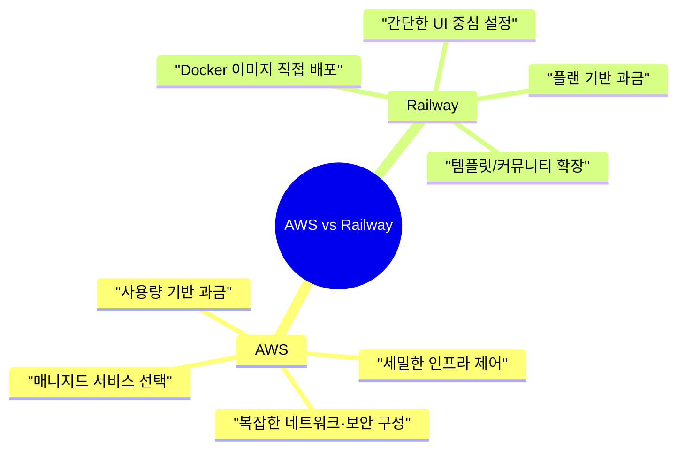

# AWS vs Railway 비교 정리

## 1. 서비스 모델 관점

- **AWS**: IaaS와 PaaS를 혼합한 초대형 클라우드로, EC2·S3·RDS처럼 AWS가 직접 운영하는 매니지드 서비스를 선택해 쓰는 방식을 기본으로 합니다.
- **Railway**: Docker 기반 PaaS라서 사용자가 어떤 이미지를 올릴지까지 직접 정할 수 있고, 공식 템플릿뿐 아니라 커뮤니티 템플릿도 클릭 한 번으로 바로 배포할 수 있습니다.

## 2. 인프라 구성 방식

- **AWS**: IAM, VPC, 보안그룹 등 세부 인프라 요소를 사용자가 직접 설계해야 해서 자유도는 높지만 초기 설정이 복잡합니다.
- **Railway**: 하나의 프로젝트(캔버스) 안에 서비스(컨테이너)와 데이터베이스를 배치하는 단순 구조라 기본 네트워크·보안이 자동으로 구성되고, 고급 커스터마이징은 제한적입니다.

## 3. 스토리지 및 파일 처리

- **AWS**: S3, EFS, EBS 같은 공식 매니지드 스토리지만 사용할 수 있고, 스토리지 계층은 AWS가 완전히 관리합니다.
- **Railway**: S3에 해당하는 매니지드 스토리지 서비스가 없으니 Volume을 마운트하거나 MinIO 등 S3 호환 컨테이너를 템플릿으로 띄워 직접 운영해야 합니다.

## 4. 데이터베이스 제공 방식

- **AWS**: RDS, DynamoDB, Aurora처럼 완전 매니지드 DB를 제공하고 백업·패치까지 AWS가 책임집니다.
- **Railway**: Postgres, MySQL, Redis도 사실 Railway가 준비한 Docker 템플릿을 자동 배포하는 형태라, 백업·버전 업·보안 패치는 사용자가 챙겨야 합니다.

## 5. 배포와 CI/CD 경험

- **AWS**: CodePipeline, CodeBuild 등을 직접 조합하거나 GitHub Actions로 연동해야 해서 기능은 풍부하지만 설정이 복잡합니다.
- **Railway**: GitHub 저장소만 연동하면 커밋 → 자동 배포 파이프라인이 기본 제공되고, 프리뷰 환경·환경 변수 관리도 UI에서 손쉽게 다룰 수 있습니다.

## 6. 네트워크 및 확장성

- **AWS**: 다중 리전·AZ, 로드밸런서, CloudFront 등 기업급 확장 기능이 탄탄하고 세밀한 튜닝이 가능합니다.
- **Railway**: 리전 선택 폭과 네트워크 제어는 제한적이지만, 기본 오토 스케일과 간단한 커스텀 도메인 연결이 바로 제공됩니다.

## 7. 커뮤니티 템플릿 문화

- **AWS**: 공식 서비스 중심이라 커뮤니티가 만든 배포 템플릿은 직접 코드로 구성해야 합니다.
- **Railway**: 공식 템플릿과 커뮤니티 템플릿이 함께 제공되어 버튼 한 번으로 다양한 조합을 실행할 수 있고, 그만큼 운영·업데이트·백업은 우리가 책임져야 합니다.

## 8. 운영 책임과 지원

- **AWS**: SLA가 명확하고 엔터프라이즈 지원 플랜도 있어서 안정성이 높지만, 인프라 설정과 보안 패치 책임은 여전히 사용자에게 있습니다.
- **Railway**: 플랫폼 자체 관리는 단순하지만, 템플릿이나 커뮤니티 컨테이너를 쓸 때 장애 대응과 데이터 보존은 사용자가 직접 챙겨야 하고 지원은 주로 커뮤니티 기반입니다.

## 9. 요금 체계 및 비용 예측

- **AWS**: 사용량 기반 과금이라 세밀하지만, 리소스 종류가 많아서 비용 예측이 어렵고 미사용 리소스를 잘 정리해야 합니다.
- **Railway**: 플랜별 포함량에 초과 사용료를 더하는 구조라 프로젝트별 비용 추적이 쉬운 대신, 대규모 트래픽이나 스토리지에는 비용 효율이 떨어질 수 있습니다.

## 10. 자유도와 사용 적합성

- **AWS 적합**: 세밀한 인프라 제어가 필요하고 대규모 트래픽·다양한 매니지드 서비스를 활용할 계획이 있는 엔터프라이즈나 중대형 프로젝트에 어울립니다.
- **Railway 적합**: 빠르게 MVP를 만들거나 소규모 팀이 Docker 기반 앱을 간편하게 배포하고 싶은 경우에 적합하며, 대신 버전 업·볼륨 백업 같은 세밀한 관리는 사용자 몫입니다.
