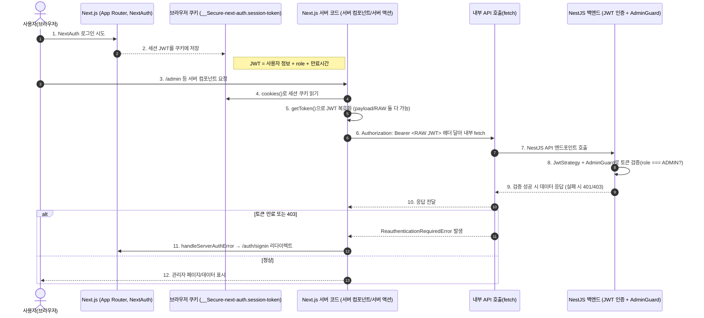

# NextAuth JWT 인증 플로우

## 1. SNS 로그인부터 세션 쿠키까지
- 사용자가 "Google로 로그인" 같은 SNS 버튼을 누르면 NextAuth가 해당 OAuth 공급자 페이지로 리다이렉트합니다.
- Google 인증이 성공하면 NextAuth는 Google에서 돌려준 프로필·이메일 정보를 기반으로 **우리 서비스 전용 JWT**를 발급합니다.
- 발급된 JWT는 브라우저의 `__Secure-next-auth.session-token` 같은 안전한 쿠키에 저장되고, 이후 요청마다 자동으로 전송됩니다.

## 2. 서버 컴포넌트·서버 액션에서 세션 확인

App Router에서는 `getServerSession(authOptions)`로 세션을 바로 읽을 수 있어서 "지금 누구인지", "ADMIN인지"를 빠르게 파악할 수 있습니다.
하지만 API 호출에 사용할 Bearer 토큰 문자열 자체는 세션 객체에 없으므로 NextAuth가 제공하는 `getToken()`을 사용해 쿠키의 JWT를 다시 복호화해야 합니다.

## 3. 쿠키 JWT 추출 (auth.ts에서 구현)

`cookies()` 헬퍼로 현재 요청에 실려온 모든 쿠키를 읽고, 우리 세션 쿠키 이름들로 재조립합니다.
`getToken({ req, secret, raw: true })`를 사용하면 쿠키에 들어 있던 JWT 문자열을 그대로 반환하고, `raw: false`를 지정하면 복호화된 payload(JWT claims)를 얻을 수 있습니다.

## 4. Authorization 헤더 만들기

방금 얻은 RAW JWT 문자열을 `Authorization: Bearer <token>` 형태로 감싸서 내부 API에 넘기면, 백엔드 NestJS에서 AdminGuard가 이 헤더를 읽고 검증합니다.
`getAuthorizationHeader()`는 바로 이 역할을 수행하도록 만들어 둔 헬퍼입니다. 서버 액션이나 서버 컴포넌트에서 API를 호출할 때 `fetch(url, { headers: await getAuthorizationHeader() })`처럼 사용하면 됩니다.

## 5. API 서버에서의 검증

- NestJS는 `JwtModule.registerAsync`에서 `ConfigService`를 통해 `JWT_SECRET` 값을 읽어 서명 검증 키로 사용합니다(`apps/blog-api/src/auth/auth.module.ts`).
- `JwtStrategy`는 `secretOrKey: JWT_SECRET`로 설정되어 있고, 요청 헤더의 Bearer 토큰을 검증한 뒤 사용자 정보(`sub`, `role` 등)를 컨트롤러에 전달합니다(`apps/blog-api/src/auth/strategies/jwt.strategy.ts`).
- 토큰이 만료되었거나 `role !== 'ADMIN'`이면 401/403을 반환하고, 프론트에서는 `ReauthenticationRequiredError`/`handleServerAuthError`로 재로그인을 안내합니다.

## 6. 재인증 UX 연결

서버 측에서는 `handleServerAuthError`로 401/403을 감지하면 `/auth/signin?error=SessionExpired` 같은 주소로 리다이렉트합니다.
클라이언트 훅에서는 `useAuthReauthentication`을 통해 같은 에러를 만나면 `signIn()`을 호출해 로그인 화면으로 보내고, 원래 페이지로 다시 돌아오도록 도와줍니다.

이렇게 브라우저 쿠키에 저장된 NextAuth 세션 JWT가 Next.js 서버 코드에서 Bearer 토큰으로 재사용되고, 최종적으로 API 서버의 JWT 인증까지 이어집니다.

## 7. 비밀키(Environment) 정합성 체크리스트

- NextAuth는 기본적으로 `NEXTAUTH_SECRET`을 사용해 세션 JWT를 서명합니다.(우리 프로젝트는 Doppler에서 관리 중입니다.)
- NestJS는 `JWT_SECRET`으로 Bearer 토큰을 검증하므로 **두 값이 반드시 동일**해야 합니다.(FE/BE 모두 동일한 문자열로 설정해야 합니다.)
- 토큰 만료 시간(`JWT_EXPIRES_IN`)도 NextAuth 설정과 맞춰두면 세션이 예기치 않게 끊기는 문제를 줄일 수 있습니다.
- 비밀키가 일치하지 않으면 백엔드에서 서명 검증이 실패하여 `Unauthorized`가 발생하니, 환경 구성 변경 시 항상 두 곳을 동시에 업데이트해야 합니다.

## 인증 플로우 다이어그램

## 정리

- **NestJS**: 완전한 백엔드 역할이라 FE에서 받은 Bearer 토큰으로만 API를 개방합니다.
- **Next.js**: FE이면서 App Router 기준 서버 컴포넌트까지 담당하므로 브라우저 쿠키를 기반으로 JWT를 복원해 백엔드와 안전하게 통신합니다.
- **에러 처리**: 토큰이 만료되면 ReauthenticationRequiredError를 던지고, 우리가 만든 헬퍼가 다시 로그인 화면으로 안내합니다.
